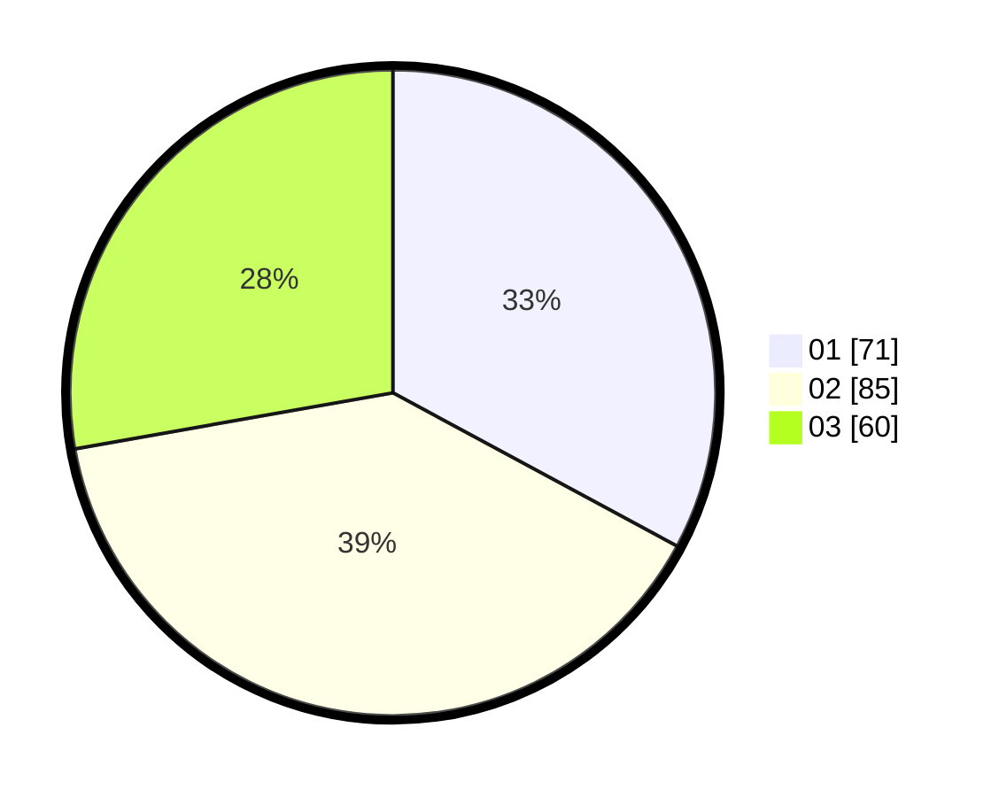

# Hasil

Hasil perolehan suara paslon dapat dilihat pada file paslon-01.txt, paslon-02.txt, dan paslon-03.txt.

Jika tidak ada, artinya data tersebut belum ada pada SIREKAP.

## Perolehan Suara

 * Paslon 01: **71**.
 * Paslon 02: **85**.
 * Paslon 03: **60**.

## Foto C Plano

https://sirekap-obj-formc.kpu.go.id/275c/pemilu/ppwp/31/71/02/10/04/3171021004001-20240216-132141--de64a114-7c3e-4546-bc47-dc677533e1f5.jpg

https://sirekap-obj-formc.kpu.go.id/275c/pemilu/ppwp/31/71/02/10/04/3171021004001-20240216-132142--adc0c3e4-48ec-450e-8cb4-af4b8c575d2a.jpg

https://sirekap-obj-formc.kpu.go.id/275c/pemilu/ppwp/31/71/02/10/04/3171021004001-20240216-132141--f205e0de-718b-45ee-a657-4cba24ca553e.jpg

## DATA PEMILIH TETAP

Jumlah pemilih dalam DPT: **282**.
 * L: **126**.
 * P: **156**.

## DATA PENGGUNA HAK PILIH

Jumlah pengguna hak pilih dalam DPT: **202**.
 * L: **91**.
 * P: **111**.

Jumlah pengguna hak pilih dalam DPTb: **10**.
 * L: **4**.
 * P: **6**.

Jumlah pengguna hak pilih dalam DPK: **5**.
 * L: **3**.
 * P: **2**.

Jumlah pengguna hak pilih: **217**.
 * L: **98**.
 * P: **119**.

## JUMLAH SUARA SAH DAN TIDAK SAH

JUMLAH SELURUH SUARA SAH: **216**.

JUMLAH SUARA TIDAK SAH: **2**.

JUMLAH SELURUH SUARA SAH DAN SUARA TIDAK SAH: **218**.
