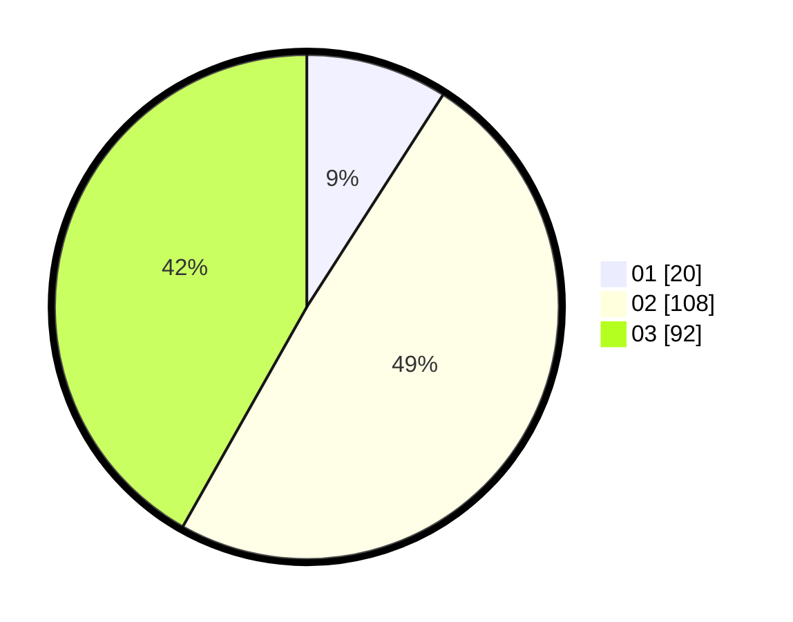

# Hasil

Hasil perolehan suara paslon dapat dilihat pada file paslon-01.txt, paslon-02.txt, dan paslon-03.txt.

Jika tidak ada, artinya data tersebut belum ada pada SIREKAP.

## Perolehan Suara

 * Paslon 01: **20**.
 * Paslon 02: **108**.
 * Paslon 03: **92**.

## Foto C Plano

https://sirekap-obj-formc.kpu.go.id/151b/pemilu/ppwp/31/71/02/10/04/3171021004003-20240216-013702--c045e8f9-d6dc-41e6-9d91-f4ff6f8df908.jpg

https://sirekap-obj-formc.kpu.go.id/151b/pemilu/ppwp/31/71/02/10/04/3171021004003-20240216-013718--d99cb1de-524c-4d59-a317-d147dd951858.jpg

https://sirekap-obj-formc.kpu.go.id/151b/pemilu/ppwp/31/71/02/10/04/3171021004003-20240216-013709--2bc6f1a5-e865-4eb9-832b-635ed822f8b1.jpg

## DATA PEMILIH TETAP

Jumlah pemilih dalam DPT: **281**.
 * L: **137**.
 * P: **144**.

## DATA PENGGUNA HAK PILIH

Jumlah pengguna hak pilih dalam DPT: **214**.
 * L: **103**.
 * P: **111**.

Jumlah pengguna hak pilih dalam DPTb: **9**.
 * L: **3**.
 * P: **6**.

Jumlah pengguna hak pilih dalam DPK: **0**.
 * L: **0**.
 * P: **0**.

Jumlah pengguna hak pilih: **223**.
 * L: **106**.
 * P: **117**.

## JUMLAH SUARA SAH DAN TIDAK SAH

JUMLAH SELURUH SUARA SAH: **220**.

JUMLAH SUARA TIDAK SAH: **3**.

JUMLAH SELURUH SUARA SAH DAN SUARA TIDAK SAH: **223**.
