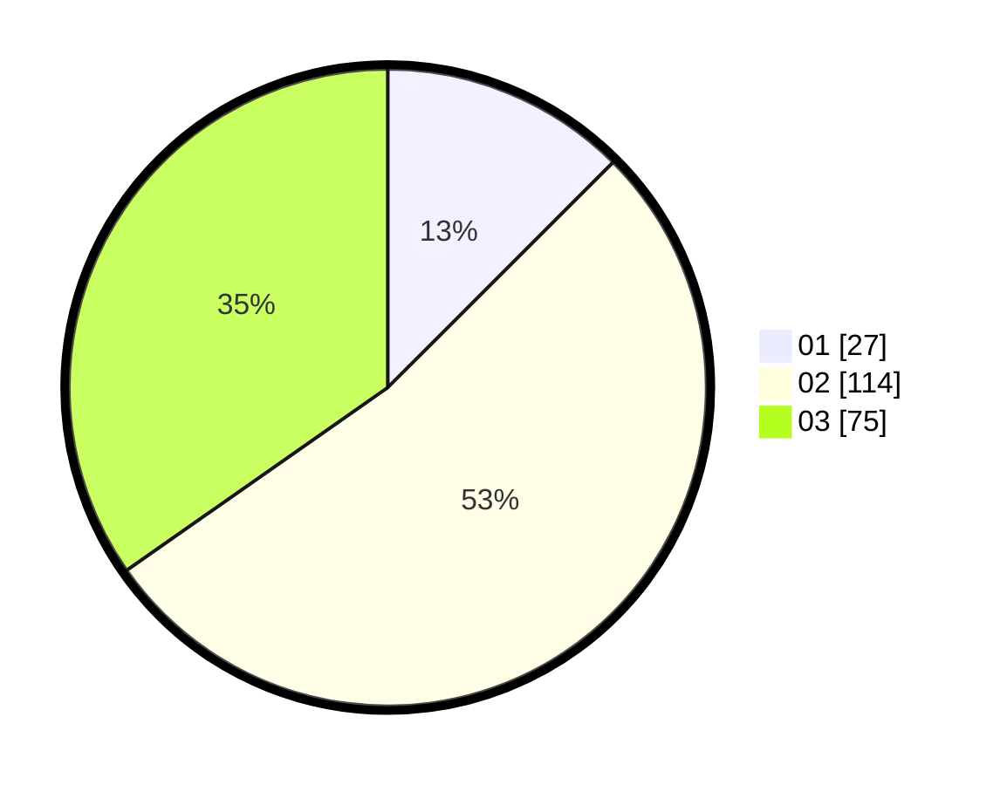

# Hasil

Hasil perolehan suara paslon dapat dilihat pada file paslon-01.txt, paslon-02.txt, dan paslon-03.txt.

Jika tidak ada, artinya data tersebut belum ada pada SIREKAP.

## Perolehan Suara

 * Paslon 01: **27**.
 * Paslon 02: **114**.
 * Paslon 03: **75**.

## Foto C Plano

https://sirekap-obj-formc.kpu.go.id/5350/pemilu/ppwp/31/71/02/10/04/3171021004004-20240217-103928--5861d460-f3d4-45d0-b53c-691c6dc9c3a7.jpg

https://sirekap-obj-formc.kpu.go.id/5350/pemilu/ppwp/31/71/02/10/04/3171021004004-20240217-103929--2c4fd37f-2f83-4f59-a91e-b6ced453ce0c.jpg

https://sirekap-obj-formc.kpu.go.id/5350/pemilu/ppwp/31/71/02/10/04/3171021004004-20240217-103929--eda44e89-6b2d-4609-9722-bf1737115654.jpg

## DATA PEMILIH TETAP

Jumlah pemilih dalam DPT: **277**.
 * L: **133**.
 * P: **144**.

## DATA PENGGUNA HAK PILIH

Jumlah pengguna hak pilih dalam DPT: **213**.
 * L: **99**.
 * P: **114**.

Jumlah pengguna hak pilih dalam DPTb: **3**.
 * L: **0**.
 * P: **3**.

Jumlah pengguna hak pilih dalam DPK: **0**.
 * L: **0**.
 * P: **0**.

Jumlah pengguna hak pilih: **216**.
 * L: **99**.
 * P: **117**.

## JUMLAH SUARA SAH DAN TIDAK SAH

JUMLAH SELURUH SUARA SAH: **216**.

JUMLAH SUARA TIDAK SAH: **0**.

JUMLAH SELURUH SUARA SAH DAN SUARA TIDAK SAH: **216**.
