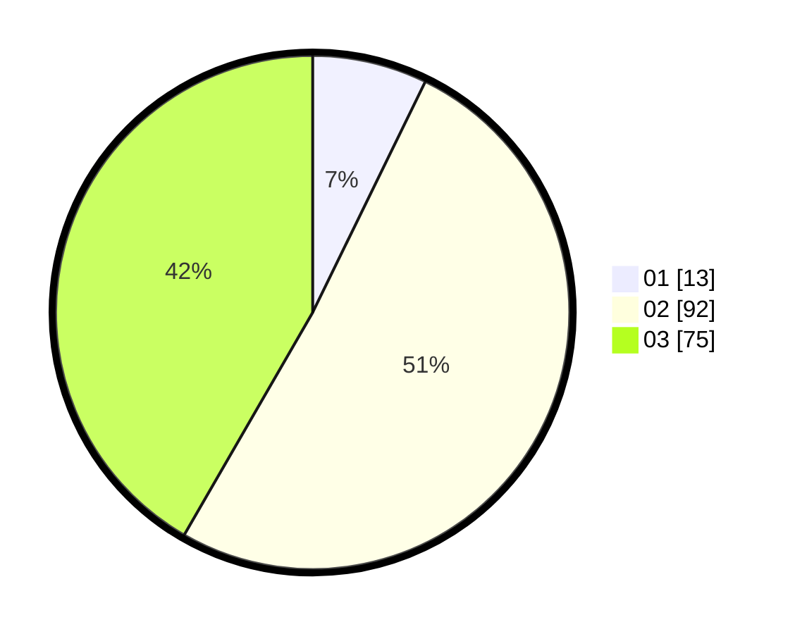

# Hasil

Hasil perolehan suara paslon dapat dilihat pada file paslon-01.txt, paslon-02.txt, dan paslon-03.txt.

Jika tidak ada, artinya data tersebut belum ada pada SIREKAP.

## Perolehan Suara

 * Paslon 01: **13**.
 * Paslon 02: **92**.
 * Paslon 03: **75**.

## Foto C Plano

https://sirekap-obj-formc.kpu.go.id/d954/pemilu/ppwp/31/71/02/10/04/3171021004006-20240216-132825--738b031d-5823-4f71-9ffb-8153605b89ac.jpg

https://sirekap-obj-formc.kpu.go.id/d954/pemilu/ppwp/31/71/02/10/04/3171021004006-20240216-132827--0e2a1410-87ac-4b8c-8aa8-5d7ef5f358b6.jpg

https://sirekap-obj-formc.kpu.go.id/d954/pemilu/ppwp/31/71/02/10/04/3171021004006-20240216-132826--18ae76ea-5ac0-4d35-9d52-2a4744791db5.jpg

## DATA PEMILIH TETAP

Jumlah pemilih dalam DPT: **253**.
 * L: **126**.
 * P: **127**.

## DATA PENGGUNA HAK PILIH

Jumlah pengguna hak pilih dalam DPT: **172**.
 * L: **80**.
 * P: **92**.

Jumlah pengguna hak pilih dalam DPTb: **7**.
 * L: **5**.
 * P: **2**.

Jumlah pengguna hak pilih dalam DPK: **5**.
 * L: **2**.
 * P: **3**.

Jumlah pengguna hak pilih: **184**.
 * L: **87**.
 * P: **97**.

## JUMLAH SUARA SAH DAN TIDAK SAH

JUMLAH SELURUH SUARA SAH: **180**.

JUMLAH SUARA TIDAK SAH: **4**.

JUMLAH SELURUH SUARA SAH DAN SUARA TIDAK SAH: **184**.
