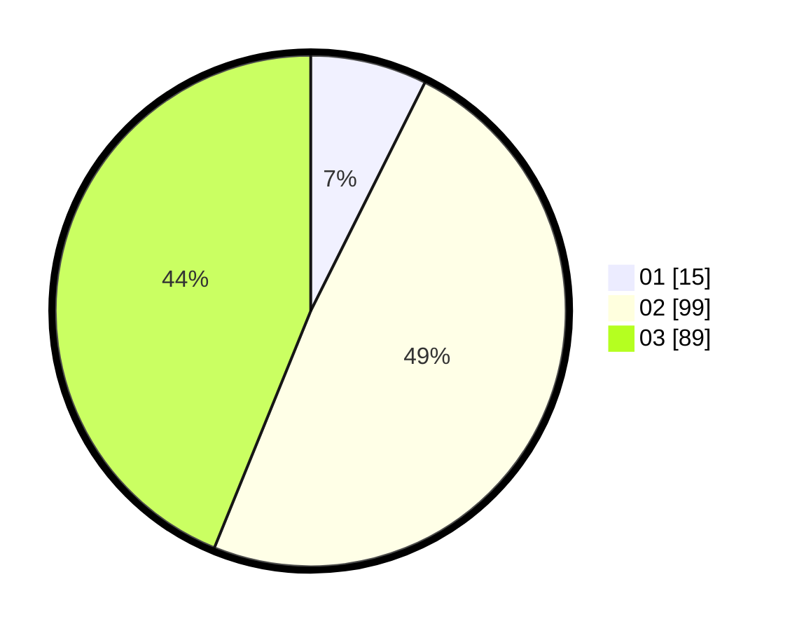

# Hasil

Hasil perolehan suara paslon dapat dilihat pada file paslon-01.txt, paslon-02.txt, dan paslon-03.txt.

Jika tidak ada, artinya data tersebut belum ada pada SIREKAP.

## Perolehan Suara

 * Paslon 01: **15**.
 * Paslon 02: **99**.
 * Paslon 03: **89**.

## Foto C Plano

https://sirekap-obj-formc.kpu.go.id/adc7/pemilu/ppwp/31/71/02/10/04/3171021004007-20240217-120258--9be550a2-a0f7-47d5-97a4-15a26e7587d2.jpg

https://sirekap-obj-formc.kpu.go.id/adc7/pemilu/ppwp/31/71/02/10/04/3171021004007-20240217-120300--c82bb413-36ec-4f0c-bf12-709713ed42be.jpg

https://sirekap-obj-formc.kpu.go.id/adc7/pemilu/ppwp/31/71/02/10/04/3171021004007-20240217-120259--8bfcc276-b87c-4198-bc40-8b19df5e2da5.jpg

## DATA PEMILIH TETAP

Jumlah pemilih dalam DPT: **270**.
 * L: **127**.
 * P: **143**.

## DATA PENGGUNA HAK PILIH

Jumlah pengguna hak pilih dalam DPT: **0**.
 * L: **0**.
 * P: **0**.

Jumlah pengguna hak pilih dalam DPTb: **0**.
 * L: **0**.
 * P: **0**.

Jumlah pengguna hak pilih dalam DPK: **0**.
 * L: **0**.
 * P: **0**.

Jumlah pengguna hak pilih: **0**.
 * L: **0**.
 * P: **0**.

## JUMLAH SUARA SAH DAN TIDAK SAH

JUMLAH SELURUH SUARA SAH: **203**.

JUMLAH SUARA TIDAK SAH: **2**.

JUMLAH SELURUH SUARA SAH DAN SUARA TIDAK SAH: **205**.
