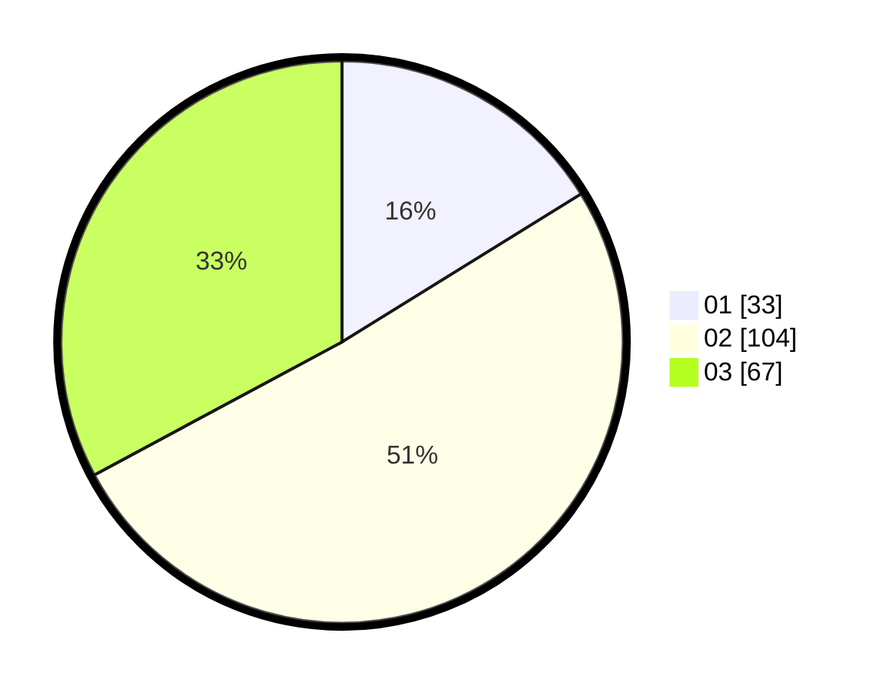

# Hasil

Hasil perolehan suara paslon dapat dilihat pada file paslon-01.txt, paslon-02.txt, dan paslon-03.txt.

Jika tidak ada, artinya data tersebut belum ada pada SIREKAP.

## Perolehan Suara

 * Paslon 01: **33**.
 * Paslon 02: **104**.
 * Paslon 03: **67**.

## Foto C Plano

https://sirekap-obj-formc.kpu.go.id/5344/pemilu/ppwp/31/71/02/10/04/3171021004008-20240214-160134--4d1472fb-622c-4922-ad96-1663d079a518.jpg

https://sirekap-obj-formc.kpu.go.id/5344/pemilu/ppwp/31/71/02/10/04/3171021004008-20240215-005651--6fa42147-920f-4b65-8a07-7f77e30ffec7.jpg

https://sirekap-obj-formc.kpu.go.id/5344/pemilu/ppwp/31/71/02/10/04/3171021004008-20240214-160055--a238db1e-de97-4adf-be05-dbf1dcce5129.jpg

## DATA PEMILIH TETAP

Jumlah pemilih dalam DPT: **275**.
 * L: **130**.
 * P: **145**.

## DATA PENGGUNA HAK PILIH

Jumlah pengguna hak pilih dalam DPT: **193**.
 * L: **89**.
 * P: **104**.

Jumlah pengguna hak pilih dalam DPTb: **12**.
 * L: **1**.
 * P: **1**.

Jumlah pengguna hak pilih dalam DPK: **1**.
 * L: **9**.
 * P: **11**.

Jumlah pengguna hak pilih: **76**.
 * L: **90**.
 * P: **116**.

## JUMLAH SUARA SAH DAN TIDAK SAH

JUMLAH SELURUH SUARA SAH: **204**.

JUMLAH SUARA TIDAK SAH: **2**.

JUMLAH SELURUH SUARA SAH DAN SUARA TIDAK SAH: **206**.
