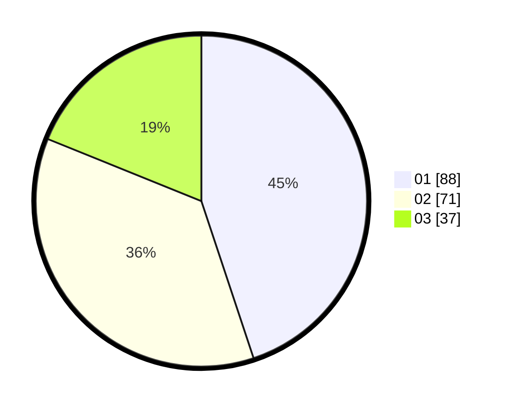

# Hasil

Hasil perolehan suara paslon dapat dilihat pada file paslon-01.txt, paslon-02.txt, dan paslon-03.txt.

Jika tidak ada, artinya data tersebut belum ada pada SIREKAP.

## Perolehan Suara

 * Paslon 01: **88**.
 * Paslon 02: **71**.
 * Paslon 03: **37**.

## Foto C Plano

https://sirekap-obj-formc.kpu.go.id/c963/pemilu/ppwp/31/71/02/10/04/3171021004010-20240214-191218--539f8c05-6b12-4b67-a173-489de4a16949.jpg

https://sirekap-obj-formc.kpu.go.id/c963/pemilu/ppwp/31/71/02/10/04/3171021004010-20240214-191229--4a68540c-72ef-45ed-b2a4-87aa1aff161f.jpg

https://sirekap-obj-formc.kpu.go.id/c963/pemilu/ppwp/31/71/02/10/04/3171021004010-20240214-191237--d9f127a3-5d28-47fa-b334-8dca1b62d0b0.jpg

## DATA PEMILIH TETAP

Jumlah pemilih dalam DPT: **271**.
 * L: **148**.
 * P: **123**.

## DATA PENGGUNA HAK PILIH

Jumlah pengguna hak pilih dalam DPT: **191**.
 * L: **103**.
 * P: **88**.

Jumlah pengguna hak pilih dalam DPTb: **3**.
 * L: **2**.
 * P: **1**.

Jumlah pengguna hak pilih dalam DPK: **4**.
 * L: **0**.
 * P: **4**.

Jumlah pengguna hak pilih: **198**.
 * L: **105**.
 * P: **93**.

## JUMLAH SUARA SAH DAN TIDAK SAH

JUMLAH SELURUH SUARA SAH: **196**.

JUMLAH SUARA TIDAK SAH: **2**.

JUMLAH SELURUH SUARA SAH DAN SUARA TIDAK SAH: **198**.
