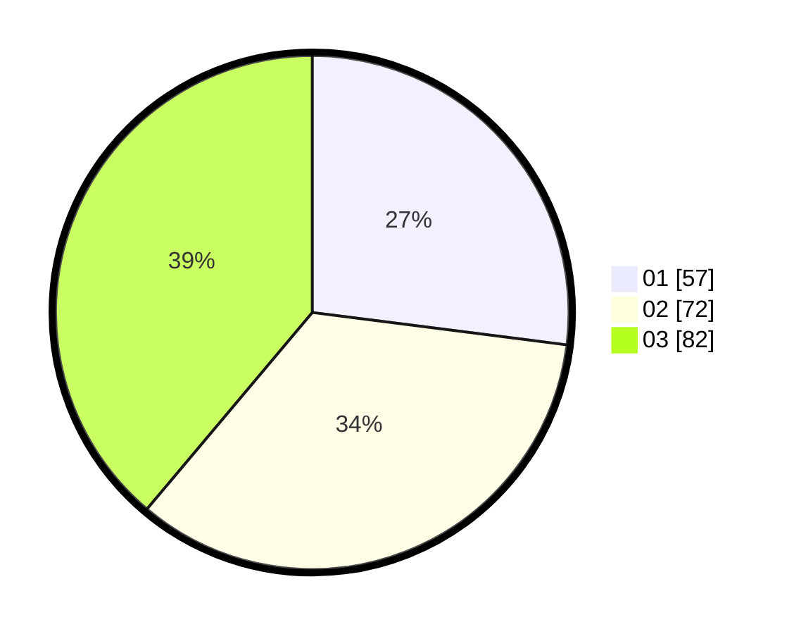

# Hasil

Hasil perolehan suara paslon dapat dilihat pada file paslon-01.txt, paslon-02.txt, dan paslon-03.txt.

Jika tidak ada, artinya data tersebut belum ada pada SIREKAP.

## Perolehan Suara

 * Paslon 01: **57**.
 * Paslon 02: **72**.
 * Paslon 03: **82**.

## Foto C Plano

https://sirekap-obj-formc.kpu.go.id/a6f8/pemilu/ppwp/31/71/02/10/04/3171021004011-20240216-182953--c6f8aa5f-8095-4732-a862-748d041501ce.jpg

https://sirekap-obj-formc.kpu.go.id/a6f8/pemilu/ppwp/31/71/02/10/04/3171021004011-20240216-182954--8ae0ee8d-29ac-4d8a-99dc-1d4e4a12eb33.jpg

https://sirekap-obj-formc.kpu.go.id/a6f8/pemilu/ppwp/31/71/02/10/04/3171021004011-20240216-182954--67f9d60e-0d8e-423e-9334-f2bf901f8197.jpg

## DATA PEMILIH TETAP

Jumlah pemilih dalam DPT: **280**.
 * L: **144**.
 * P: **136**.

## DATA PENGGUNA HAK PILIH

Jumlah pengguna hak pilih dalam DPT: **202**.
 * L: **106**.
 * P: **96**.

Jumlah pengguna hak pilih dalam DPTb: **5**.
 * L: **4**.
 * P: **1**.

Jumlah pengguna hak pilih dalam DPK: **9**.
 * L: **3**.
 * P: **6**.

Jumlah pengguna hak pilih: **216**.
 * L: **113**.
 * P: **103**.

## JUMLAH SUARA SAH DAN TIDAK SAH

JUMLAH SELURUH SUARA SAH: **211**.

JUMLAH SUARA TIDAK SAH: **5**.

JUMLAH SELURUH SUARA SAH DAN SUARA TIDAK SAH: **216**.
