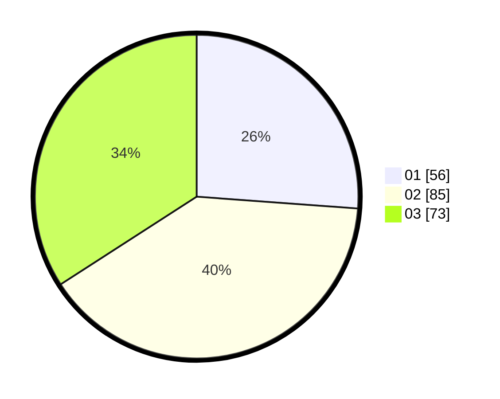

# Hasil

Hasil perolehan suara paslon dapat dilihat pada file paslon-01.txt, paslon-02.txt, dan paslon-03.txt.

Jika tidak ada, artinya data tersebut belum ada pada SIREKAP.

## Perolehan Suara

 * Paslon 01: **56**.
 * Paslon 02: **85**.
 * Paslon 03: **73**.

## Foto C Plano

https://sirekap-obj-formc.kpu.go.id/baac/pemilu/ppwp/31/71/02/10/04/3171021004012-20240214-184649--8ddac0ad-806f-48de-9005-905250b68c58.jpg

https://sirekap-obj-formc.kpu.go.id/baac/pemilu/ppwp/31/71/02/10/04/3171021004012-20240214-184700--37d58ec9-c29b-4be2-b9e0-4dd2dac18d54.jpg

https://sirekap-obj-formc.kpu.go.id/baac/pemilu/ppwp/31/71/02/10/04/3171021004012-20240214-184705--0f65b1e4-f203-4259-afc0-fcbf837675fd.jpg

## DATA PEMILIH TETAP

Jumlah pemilih dalam DPT: **274**.
 * L: **136**.
 * P: **138**.

## DATA PENGGUNA HAK PILIH

Jumlah pengguna hak pilih dalam DPT: **203**.
 * L: **97**.
 * P: **106**.

Jumlah pengguna hak pilih dalam DPTb: **8**.
 * L: **3**.
 * P: **5**.

Jumlah pengguna hak pilih dalam DPK: **4**.
 * L: **2**.
 * P: **2**.

Jumlah pengguna hak pilih: **215**.
 * L: **102**.
 * P: **113**.

## JUMLAH SUARA SAH DAN TIDAK SAH

JUMLAH SELURUH SUARA SAH: **214**.

JUMLAH SUARA TIDAK SAH: **1**.

JUMLAH SELURUH SUARA SAH DAN SUARA TIDAK SAH: **215**.
