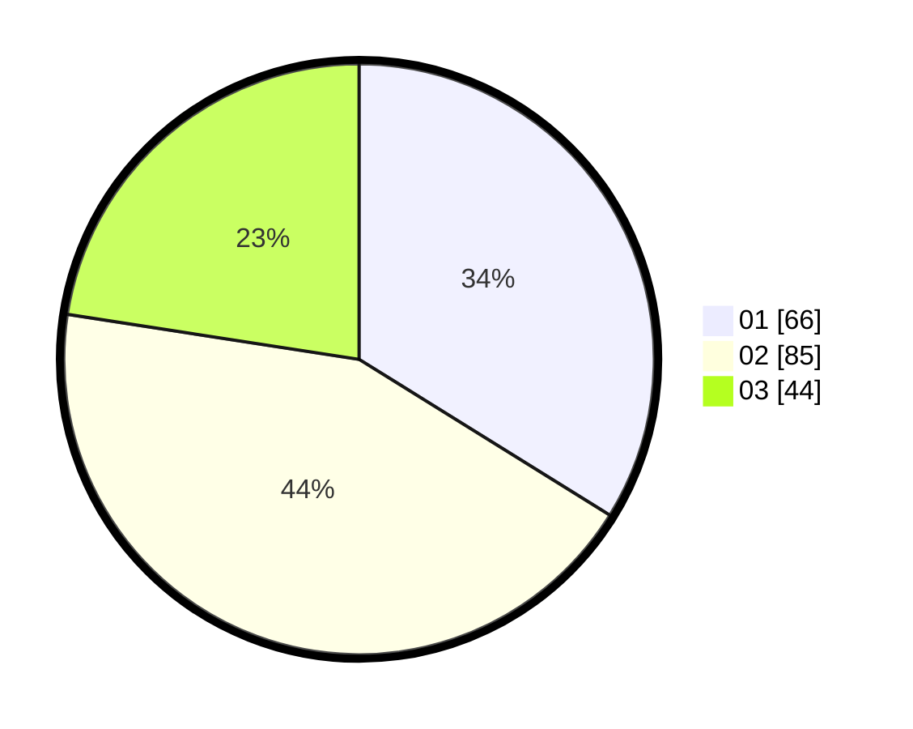

# Hasil

Hasil perolehan suara paslon dapat dilihat pada file paslon-01.txt, paslon-02.txt, dan paslon-03.txt.

Jika tidak ada, artinya data tersebut belum ada pada SIREKAP.

## Perolehan Suara

 * Paslon 01: **66**.
 * Paslon 02: **85**.
 * Paslon 03: **44**.

## Foto C Plano

https://sirekap-obj-formc.kpu.go.id/74c5/pemilu/ppwp/31/71/02/10/04/3171021004013-20240214-185154--9a1c2dac-7f4d-4365-a9a0-53e64f32dea1.jpg

https://sirekap-obj-formc.kpu.go.id/74c5/pemilu/ppwp/31/71/02/10/04/3171021004013-20240215-041442--759f2f24-d95e-4bda-b54d-b4e00e65376a.jpg

https://sirekap-obj-formc.kpu.go.id/74c5/pemilu/ppwp/31/71/02/10/04/3171021004013-20240214-184954--6c5c4402-4b69-4940-b9f6-401e8450cacd.jpg

## DATA PEMILIH TETAP

Jumlah pemilih dalam DPT: **265**.
 * L: **137**.
 * P: **128**.

## DATA PENGGUNA HAK PILIH

Jumlah pengguna hak pilih dalam DPT: **191**.
 * L: **92**.
 * P: **99**.

Jumlah pengguna hak pilih dalam DPTb: **2**.
 * L: **1**.
 * P: **1**.

Jumlah pengguna hak pilih dalam DPK: **2**.
 * L: **1**.
 * P: **1**.

Jumlah pengguna hak pilih: **195**.
 * L: **94**.
 * P: **101**.

## JUMLAH SUARA SAH DAN TIDAK SAH

JUMLAH SELURUH SUARA SAH: **195**.

JUMLAH SUARA TIDAK SAH: **0**.

JUMLAH SELURUH SUARA SAH DAN SUARA TIDAK SAH: **195**.
