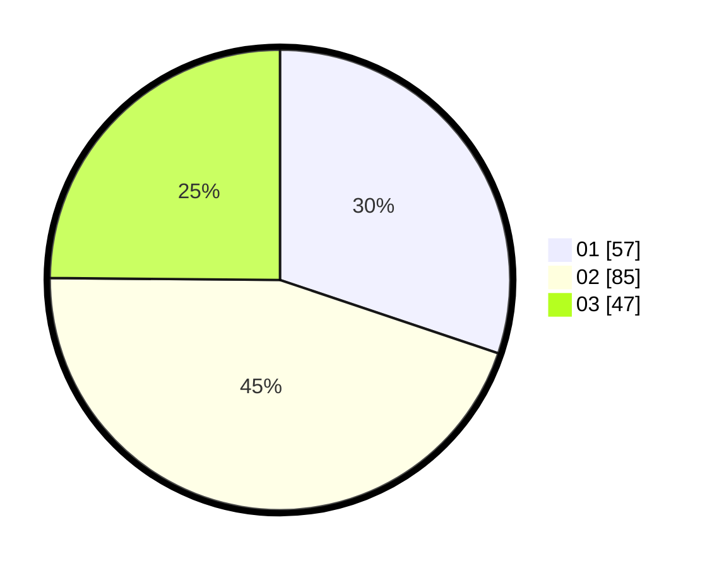

# Hasil

Hasil perolehan suara paslon dapat dilihat pada file paslon-01.txt, paslon-02.txt, dan paslon-03.txt.

Jika tidak ada, artinya data tersebut belum ada pada SIREKAP.

## Perolehan Suara

 * Paslon 01: **57**.
 * Paslon 02: **85**.
 * Paslon 03: **47**.

## Foto C Plano

https://sirekap-obj-formc.kpu.go.id/ebe5/pemilu/ppwp/31/71/02/10/04/3171021004014-20240217-104802--9104d0fd-1c20-4369-add5-a87f5e744ecb.jpg

https://sirekap-obj-formc.kpu.go.id/ebe5/pemilu/ppwp/31/71/02/10/04/3171021004014-20240217-104803--01d18bf7-b9aa-4349-b221-0a22a16284cf.jpg

https://sirekap-obj-formc.kpu.go.id/ebe5/pemilu/ppwp/31/71/02/10/04/3171021004014-20240217-104803--b0a39076-dbff-4e7c-a2a5-7fd954f7571f.jpg

## DATA PEMILIH TETAP

Jumlah pemilih dalam DPT: **254**.
 * L: **134**.
 * P: **120**.

## DATA PENGGUNA HAK PILIH

Jumlah pengguna hak pilih dalam DPT: **181**.
 * L: **99**.
 * P: **82**.

Jumlah pengguna hak pilih dalam DPTb: **10**.
 * L: **4**.
 * P: **6**.

Jumlah pengguna hak pilih dalam DPK: **4**.
 * L: **3**.
 * P: **1**.

Jumlah pengguna hak pilih: **195**.
 * L: **106**.
 * P: **89**.

## JUMLAH SUARA SAH DAN TIDAK SAH

JUMLAH SELURUH SUARA SAH: **189**.

JUMLAH SUARA TIDAK SAH: **6**.

JUMLAH SELURUH SUARA SAH DAN SUARA TIDAK SAH: **195**.
