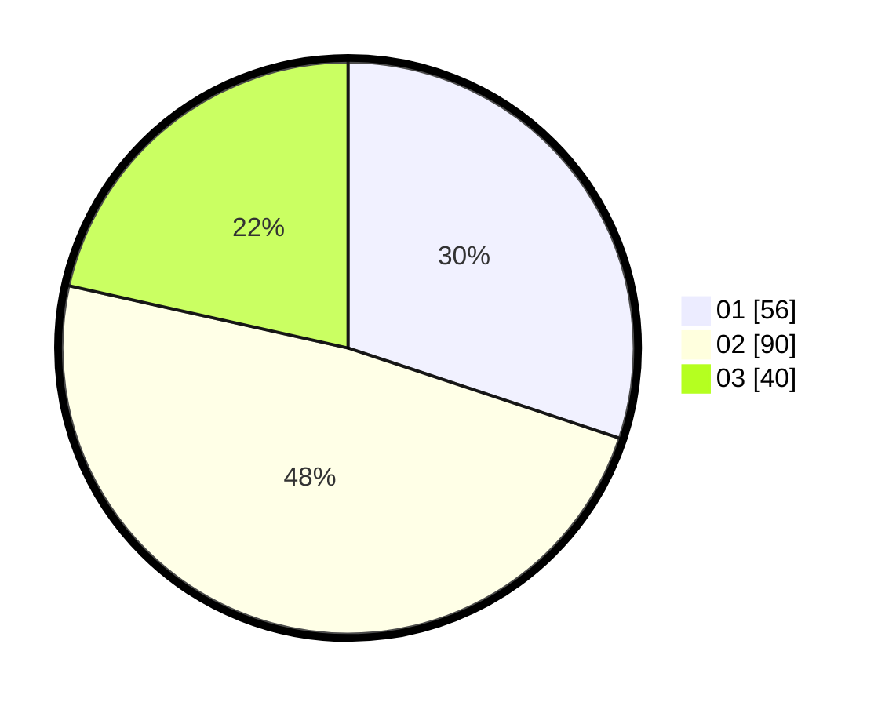

# Hasil

Hasil perolehan suara paslon dapat dilihat pada file paslon-01.txt, paslon-02.txt, dan paslon-03.txt.

Jika tidak ada, artinya data tersebut belum ada pada SIREKAP.

## Perolehan Suara

 * Paslon 01: **56**.
 * Paslon 02: **90**.
 * Paslon 03: **40**.

## Foto C Plano

https://sirekap-obj-formc.kpu.go.id/43fa/pemilu/ppwp/31/71/02/10/04/3171021004017-20240214-190623--f2f4125a-410c-4a49-b077-505a0f2f563c.jpg

https://sirekap-obj-formc.kpu.go.id/43fa/pemilu/ppwp/31/71/02/10/04/3171021004017-20240214-190640--4de2f7f2-1f22-4029-91ba-6bd7142adc7f.jpg

https://sirekap-obj-formc.kpu.go.id/43fa/pemilu/ppwp/31/71/02/10/04/3171021004017-20240214-205522--7164794b-f609-4d1c-bbd6-ea12a51677a8.jpg

## DATA PEMILIH TETAP

Jumlah pemilih dalam DPT: **265**.
 * L: **136**.
 * P: **129**.

## DATA PENGGUNA HAK PILIH

Jumlah pengguna hak pilih dalam DPT: **188**.
 * L: **92**.
 * P: **93**.

Jumlah pengguna hak pilih dalam DPTb: **5**.
 * L: **3**.
 * P: **2**.

Jumlah pengguna hak pilih dalam DPK: **0**.
 * L: **0**.
 * P: **0**.

Jumlah pengguna hak pilih: **190**.
 * L: **95**.
 * P: **95**.

## JUMLAH SUARA SAH DAN TIDAK SAH

JUMLAH SELURUH SUARA SAH: **185**.

JUMLAH SUARA TIDAK SAH: **64**.

JUMLAH SELURUH SUARA SAH DAN SUARA TIDAK SAH: **190**.
