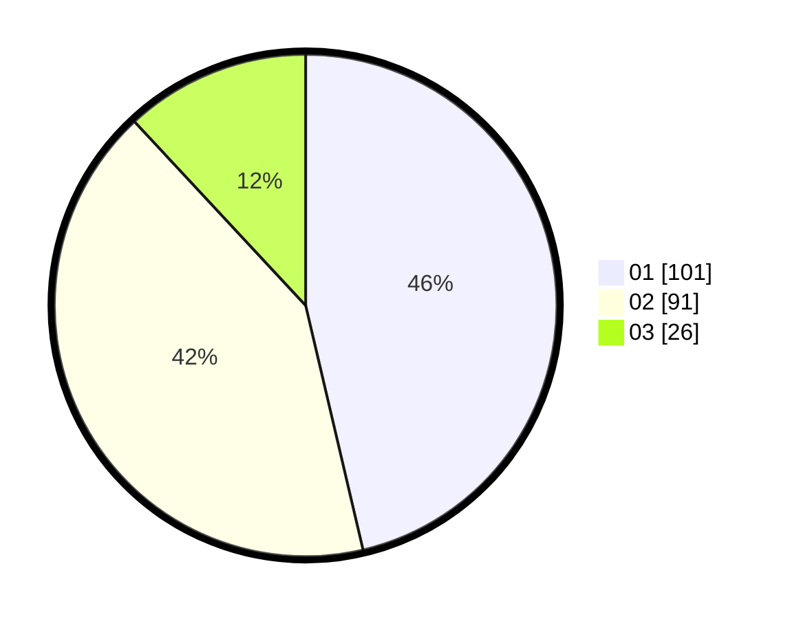

# Hasil

Hasil perolehan suara paslon dapat dilihat pada file paslon-01.txt, paslon-02.txt, dan paslon-03.txt.

Jika tidak ada, artinya data tersebut belum ada pada SIREKAP.

## Perolehan Suara

 * Paslon 01: **101**.
 * Paslon 02: **91**.
 * Paslon 03: **26**.

## Foto C Plano

https://sirekap-obj-formc.kpu.go.id/c7ef/pemilu/ppwp/31/71/02/10/04/3171021004019-20240214-155107--9a868a03-d8c8-4aab-bfad-8a2e4734ca5d.jpg

https://sirekap-obj-formc.kpu.go.id/c7ef/pemilu/ppwp/31/71/02/10/04/3171021004019-20240214-155252--5c55e292-01d8-4b87-8419-ed9203ff6fb8.jpg

https://sirekap-obj-formc.kpu.go.id/c7ef/pemilu/ppwp/31/71/02/10/04/3171021004019-20240214-155432--2bd86665-5b55-46fd-a8f0-2ee899d277c9.jpg

## DATA PEMILIH TETAP

Jumlah pemilih dalam DPT: **284**.
 * L: **150**.
 * P: **134**.

## DATA PENGGUNA HAK PILIH

Jumlah pengguna hak pilih dalam DPT: **222**.
 * L: **112**.
 * P: **110**.

Jumlah pengguna hak pilih dalam DPTb: **1**.
 * L: **0**.
 * P: **1**.

Jumlah pengguna hak pilih dalam DPK: **0**.
 * L: **0**.
 * P: **0**.

Jumlah pengguna hak pilih: **223**.
 * L: **112**.
 * P: **111**.

## JUMLAH SUARA SAH DAN TIDAK SAH

JUMLAH SELURUH SUARA SAH: **218**.

JUMLAH SUARA TIDAK SAH: **5**.

JUMLAH SELURUH SUARA SAH DAN SUARA TIDAK SAH: **223**.
