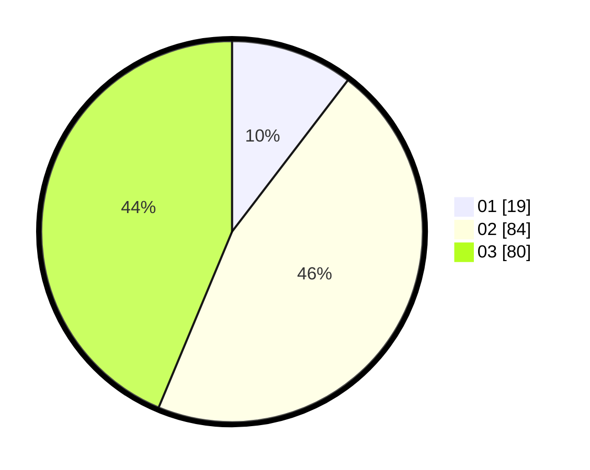

# Hasil

Hasil perolehan suara paslon dapat dilihat pada file paslon-01.txt, paslon-02.txt, dan paslon-03.txt.

Jika tidak ada, artinya data tersebut belum ada pada SIREKAP.

## Perolehan Suara

 * Paslon 01: **19**.
 * Paslon 02: **84**.
 * Paslon 03: **80**.

## Foto C Plano

https://sirekap-obj-formc.kpu.go.id/9f64/pemilu/ppwp/31/71/02/10/04/3171021004021-20240216-234108--80c69714-b327-43d2-8743-9ff022643e11.jpg

https://sirekap-obj-formc.kpu.go.id/9f64/pemilu/ppwp/31/71/02/10/04/3171021004021-20240216-234110--56662ef4-8c30-44bd-a3cd-2bb75fe3510a.jpg

https://sirekap-obj-formc.kpu.go.id/9f64/pemilu/ppwp/31/71/02/10/04/3171021004021-20240216-234109--f968a24d-ad70-4ff4-8d3a-eec35c2099d1.jpg

## DATA PEMILIH TETAP

Jumlah pemilih dalam DPT: **281**.
 * L: **121**.
 * P: **160**.

## DATA PENGGUNA HAK PILIH

Jumlah pengguna hak pilih dalam DPT: **194**.
 * L: **87**.
 * P: **107**.

Jumlah pengguna hak pilih dalam DPTb: **2**.
 * L: **1**.
 * P: **1**.

Jumlah pengguna hak pilih dalam DPK: **0**.
 * L: **0**.
 * P: **0**.

Jumlah pengguna hak pilih: **196**.
 * L: **88**.
 * P: **108**.

## JUMLAH SUARA SAH DAN TIDAK SAH

JUMLAH SELURUH SUARA SAH: **183**.

JUMLAH SUARA TIDAK SAH: **13**.

JUMLAH SELURUH SUARA SAH DAN SUARA TIDAK SAH: **196**.
