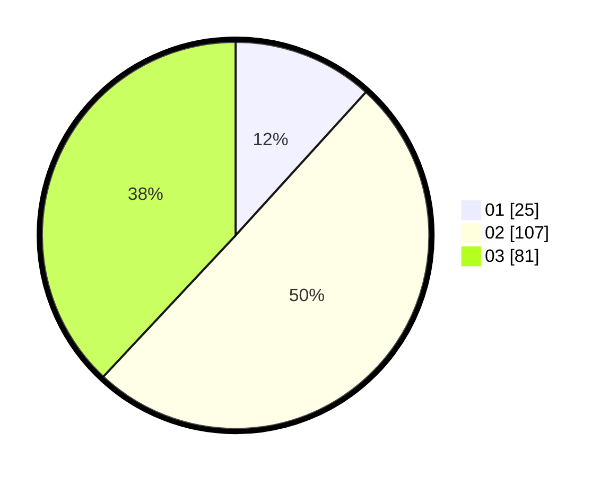

# Hasil

Hasil perolehan suara paslon dapat dilihat pada file paslon-01.txt, paslon-02.txt, dan paslon-03.txt.

Jika tidak ada, artinya data tersebut belum ada pada SIREKAP.

## Perolehan Suara

 * Paslon 01: **25**.
 * Paslon 02: **107**.
 * Paslon 03: **81**.

## Foto C Plano

https://sirekap-obj-formc.kpu.go.id/fa3a/pemilu/ppwp/31/71/02/10/04/3171021004022-20240216-231912--a4c5882b-4ce4-4a06-a267-86b5d65f11b8.jpg

https://sirekap-obj-formc.kpu.go.id/fa3a/pemilu/ppwp/31/71/02/10/04/3171021004022-20240216-231913--559bcd77-8b31-4f87-b224-592601afe41c.jpg

https://sirekap-obj-formc.kpu.go.id/fa3a/pemilu/ppwp/31/71/02/10/04/3171021004022-20240216-231913--78114f32-8d7c-43ee-ac4b-08879511dc35.jpg

## DATA PEMILIH TETAP

Jumlah pemilih dalam DPT: **205**.
 * L: **90**.
 * P: **115**.

## DATA PENGGUNA HAK PILIH

Jumlah pengguna hak pilih dalam DPT: **205**.
 * L: **90**.
 * P: **115**.

Jumlah pengguna hak pilih dalam DPTb: **3**.
 * L: **2**.
 * P: **1**.

Jumlah pengguna hak pilih dalam DPK: **5**.
 * L: **3**.
 * P: **2**.

Jumlah pengguna hak pilih: **213**.
 * L: **95**.
 * P: **118**.

## JUMLAH SUARA SAH DAN TIDAK SAH

JUMLAH SELURUH SUARA SAH: **213**.

JUMLAH SUARA TIDAK SAH: **0**.

JUMLAH SELURUH SUARA SAH DAN SUARA TIDAK SAH: **213**.
