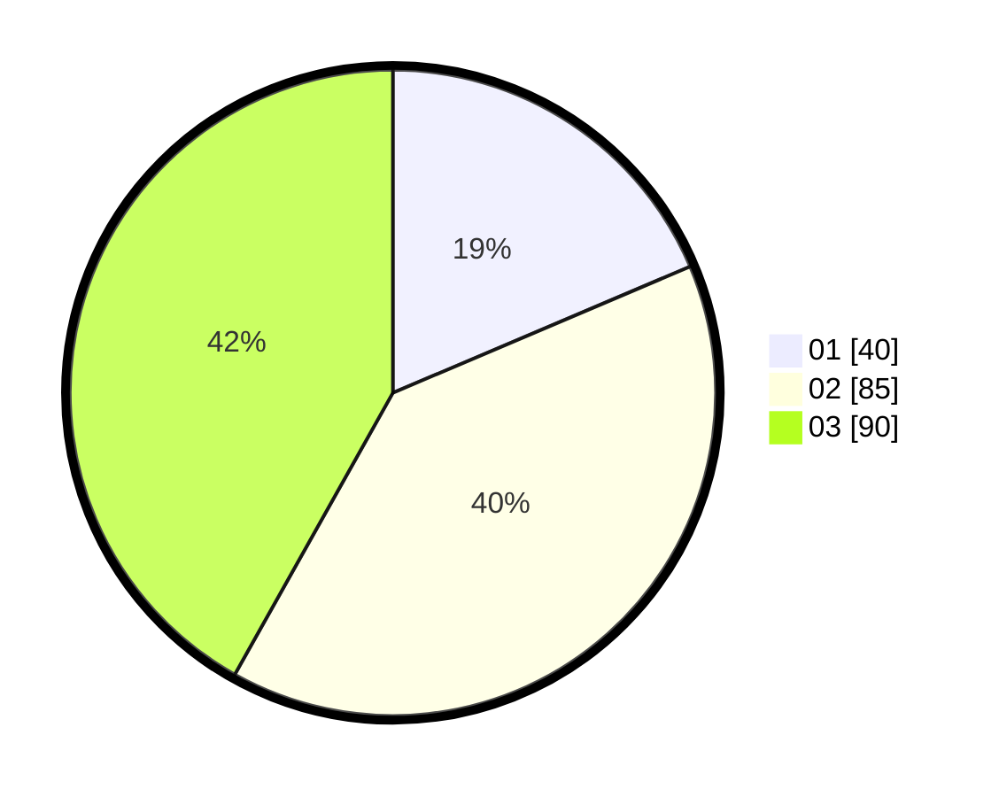

# Hasil

Hasil perolehan suara paslon dapat dilihat pada file paslon-01.txt, paslon-02.txt, dan paslon-03.txt.

Jika tidak ada, artinya data tersebut belum ada pada SIREKAP.

## Perolehan Suara

 * Paslon 01: **40**.
 * Paslon 02: **85**.
 * Paslon 03: **90**.

## Foto C Plano

https://sirekap-obj-formc.kpu.go.id/649f/pemilu/ppwp/31/71/02/10/04/3171021004024-20240214-195957--1ffbfb9d-b759-4187-a61e-87151fa6d182.jpg

https://sirekap-obj-formc.kpu.go.id/649f/pemilu/ppwp/31/71/02/10/04/3171021004024-20240214-200232--2a2abcde-f450-4db4-a1ce-3ff270516609.jpg

https://sirekap-obj-formc.kpu.go.id/649f/pemilu/ppwp/31/71/02/10/04/3171021004024-20240214-200421--95c53e20-c4f6-420d-9ea6-305909281351.jpg

## DATA PEMILIH TETAP

Jumlah pemilih dalam DPT: **267**.
 * L: **137**.
 * P: **130**.

## DATA PENGGUNA HAK PILIH

Jumlah pengguna hak pilih dalam DPT: **210**.
 * L: **107**.
 * P: **103**.

Jumlah pengguna hak pilih dalam DPTb: **5**.
 * L: **1**.
 * P: **4**.

Jumlah pengguna hak pilih dalam DPK: **1**.
 * L: **1**.
 * P: **0**.

Jumlah pengguna hak pilih: **216**.
 * L: **109**.
 * P: **107**.

## JUMLAH SUARA SAH DAN TIDAK SAH

JUMLAH SELURUH SUARA SAH: **215**.

JUMLAH SUARA TIDAK SAH: **1**.

JUMLAH SELURUH SUARA SAH DAN SUARA TIDAK SAH: **216**.
