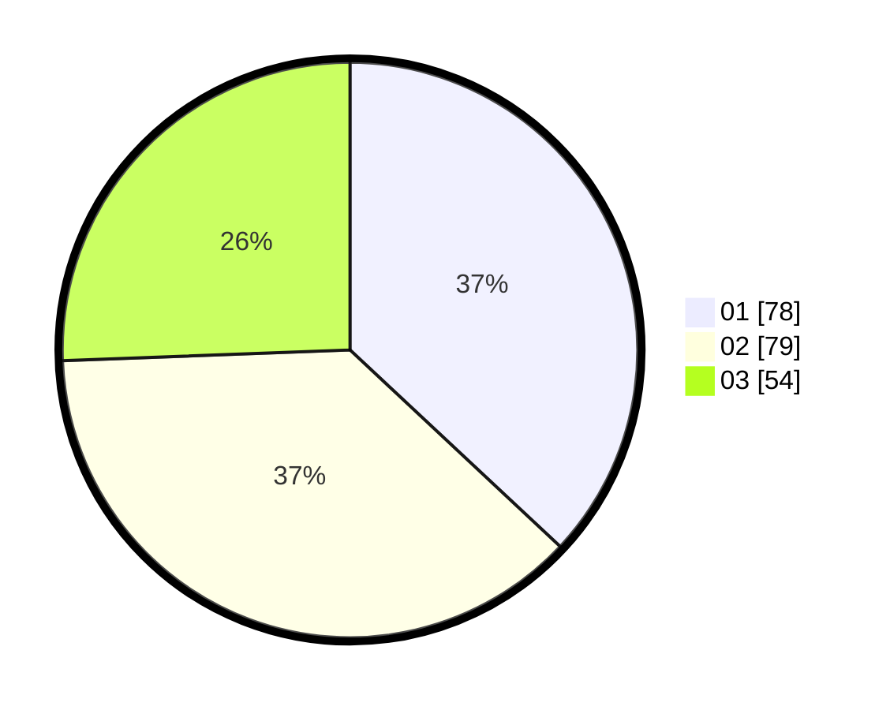

# Hasil

Hasil perolehan suara paslon dapat dilihat pada file paslon-01.txt, paslon-02.txt, dan paslon-03.txt.

Jika tidak ada, artinya data tersebut belum ada pada SIREKAP.

## Perolehan Suara

 * Paslon 01: **78**.
 * Paslon 02: **79**.
 * Paslon 03: **54**.

## Foto C Plano

https://sirekap-obj-formc.kpu.go.id/90a7/pemilu/ppwp/31/71/02/10/04/3171021004028-20240216-161331--df81571e-d885-4efd-a8d0-3b31d86a8e76.jpg

https://sirekap-obj-formc.kpu.go.id/90a7/pemilu/ppwp/31/71/02/10/04/3171021004028-20240216-161333--5169affe-695c-4d80-b6c5-77272726d945.jpg

https://sirekap-obj-formc.kpu.go.id/90a7/pemilu/ppwp/31/71/02/10/04/3171021004028-20240216-161332--5ac1bdf9-cc86-4b76-9a50-790f95c4f65f.jpg

## DATA PEMILIH TETAP

Jumlah pemilih dalam DPT: **280**.
 * L: **131**.
 * P: **149**.

## DATA PENGGUNA HAK PILIH

Jumlah pengguna hak pilih dalam DPT: **209**.
 * L: **94**.
 * P: **115**.

Jumlah pengguna hak pilih dalam DPTb: **3**.
 * L: **2**.
 * P: **1**.

Jumlah pengguna hak pilih dalam DPK: **1**.
 * L: **1**.
 * P: **0**.

Jumlah pengguna hak pilih: **213**.
 * L: **97**.
 * P: **116**.

## JUMLAH SUARA SAH DAN TIDAK SAH

JUMLAH SELURUH SUARA SAH: **211**.

JUMLAH SUARA TIDAK SAH: **2**.

JUMLAH SELURUH SUARA SAH DAN SUARA TIDAK SAH: **213**.
