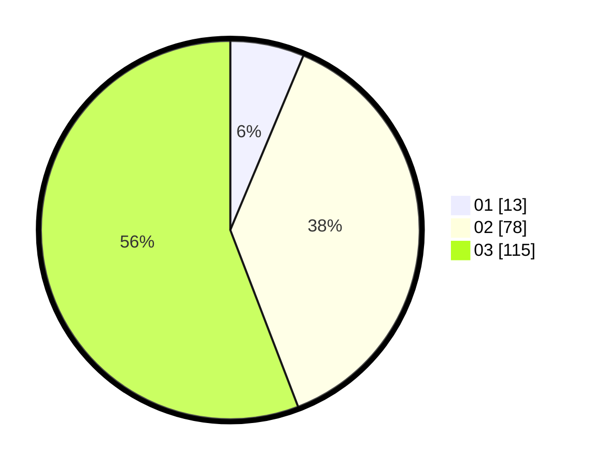

# Hasil

Hasil perolehan suara paslon dapat dilihat pada file paslon-01.txt, paslon-02.txt, dan paslon-03.txt.

Jika tidak ada, artinya data tersebut belum ada pada SIREKAP.

## Perolehan Suara

 * Paslon 01: **13**.
 * Paslon 02: **78**.
 * Paslon 03: **115**.

## Foto C Plano

https://sirekap-obj-formc.kpu.go.id/25b6/pemilu/ppwp/31/71/02/10/04/3171021004030-20240215-214455--87e47a26-6279-42dd-a187-bca2e7a1cf7d.jpg

https://sirekap-obj-formc.kpu.go.id/25b6/pemilu/ppwp/31/71/02/10/04/3171021004030-20240215-214457--8cd102a3-d79c-434e-8e87-e18d9fab859d.jpg

https://sirekap-obj-formc.kpu.go.id/25b6/pemilu/ppwp/31/71/02/10/04/3171021004030-20240215-214456--0a84a84b-c96e-4a05-8a50-03779ca7a8a6.jpg

## DATA PEMILIH TETAP

Jumlah pemilih dalam DPT: **0**.
 * L: **0**.
 * P: **0**.

## DATA PENGGUNA HAK PILIH

Jumlah pengguna hak pilih dalam DPT: **0**.
 * L: **0**.
 * P: **0**.

Jumlah pengguna hak pilih dalam DPTb: **0**.
 * L: **0**.
 * P: **0**.

Jumlah pengguna hak pilih dalam DPK: **0**.
 * L: **0**.
 * P: **0**.

Jumlah pengguna hak pilih: **0**.
 * L: **0**.
 * P: **0**.

## JUMLAH SUARA SAH DAN TIDAK SAH

JUMLAH SELURUH SUARA SAH: **206**.

JUMLAH SUARA TIDAK SAH: **1**.

JUMLAH SELURUH SUARA SAH DAN SUARA TIDAK SAH: **207**.
