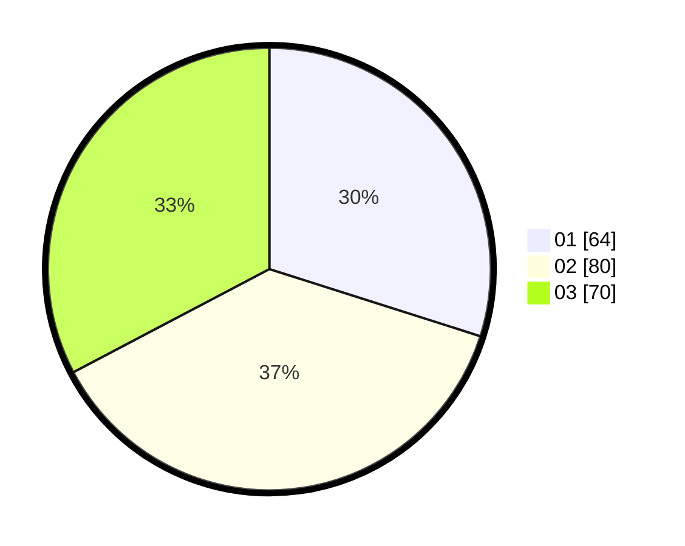

# Hasil

Hasil perolehan suara paslon dapat dilihat pada file paslon-01.txt, paslon-02.txt, dan paslon-03.txt.

Jika tidak ada, artinya data tersebut belum ada pada SIREKAP.

## Perolehan Suara

 * Paslon 01: **64**.
 * Paslon 02: **80**.
 * Paslon 03: **70**.

## Foto C Plano

https://sirekap-obj-formc.kpu.go.id/ee3a/pemilu/ppwp/31/71/02/10/04/3171021004034-20240216-030031--02958bba-de5e-471e-9f40-f887a2080e04.jpg

https://sirekap-obj-formc.kpu.go.id/ee3a/pemilu/ppwp/31/71/02/10/04/3171021004034-20240214-155207--a969511f-1e39-4c17-89cf-6c62ca75c114.jpg

https://sirekap-obj-formc.kpu.go.id/ee3a/pemilu/ppwp/31/71/02/10/04/3171021004034-20240214-155323--47c8ae02-efdc-426b-ae24-e034bb8c5d5e.jpg

## DATA PEMILIH TETAP

Jumlah pemilih dalam DPT: **282**.
 * L: **140**.
 * P: **142**.

## DATA PENGGUNA HAK PILIH

Jumlah pengguna hak pilih dalam DPT: **208**.
 * L: **99**.
 * P: **109**.

Jumlah pengguna hak pilih dalam DPTb: **2**.
 * L: **0**.
 * P: **2**.

Jumlah pengguna hak pilih dalam DPK: **5**.
 * L: **2**.
 * P: **3**.

Jumlah pengguna hak pilih: **215**.
 * L: **101**.
 * P: **114**.

## JUMLAH SUARA SAH DAN TIDAK SAH

JUMLAH SELURUH SUARA SAH: **214**.

JUMLAH SUARA TIDAK SAH: **3**.

JUMLAH SELURUH SUARA SAH DAN SUARA TIDAK SAH: **217**.
