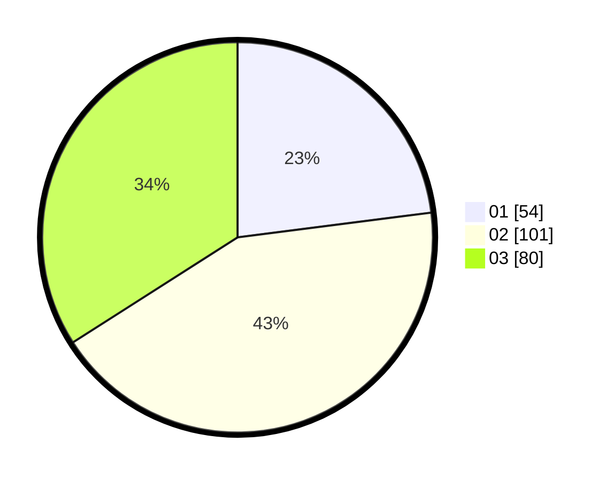

# Hasil

Hasil perolehan suara paslon dapat dilihat pada file paslon-01.txt, paslon-02.txt, dan paslon-03.txt.

Jika tidak ada, artinya data tersebut belum ada pada SIREKAP.

## Perolehan Suara

 * Paslon 01: **54**.
 * Paslon 02: **101**.
 * Paslon 03: **80**.

## Foto C Plano

https://sirekap-obj-formc.kpu.go.id/5871/pemilu/ppwp/31/71/02/10/04/3171021004037-20240217-111929--e896077f-e943-472e-a79a-440a9f873955.jpg

https://sirekap-obj-formc.kpu.go.id/5871/pemilu/ppwp/31/71/02/10/04/3171021004037-20240217-111930--3aa02a2b-96af-4abc-b430-f3e4808254b7.jpg

https://sirekap-obj-formc.kpu.go.id/5871/pemilu/ppwp/31/71/02/10/04/3171021004037-20240217-111929--585f300c-7c6a-44e9-b750-4f7a71718f6f.jpg

## DATA PEMILIH TETAP

Jumlah pemilih dalam DPT: **291**.
 * L: **138**.
 * P: **153**.

## DATA PENGGUNA HAK PILIH

Jumlah pengguna hak pilih dalam DPT: **220**.
 * L: **102**.
 * P: **118**.

Jumlah pengguna hak pilih dalam DPTb: **14**.
 * L: **8**.
 * P: **6**.

Jumlah pengguna hak pilih dalam DPK: **1**.
 * L: **0**.
 * P: **1**.

Jumlah pengguna hak pilih: **235**.
 * L: **110**.
 * P: **125**.

## JUMLAH SUARA SAH DAN TIDAK SAH

JUMLAH SELURUH SUARA SAH: **235**.

JUMLAH SUARA TIDAK SAH: **0**.

JUMLAH SELURUH SUARA SAH DAN SUARA TIDAK SAH: **235**.
