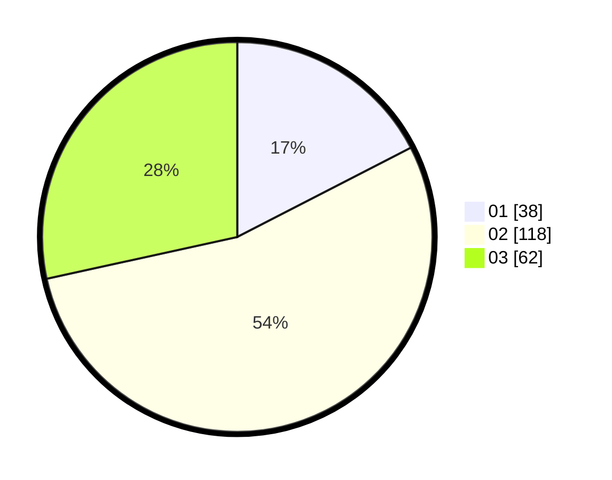

# Hasil

Hasil perolehan suara paslon dapat dilihat pada file paslon-01.txt, paslon-02.txt, dan paslon-03.txt.

Jika tidak ada, artinya data tersebut belum ada pada SIREKAP.

## Perolehan Suara

 * Paslon 01: **38**.
 * Paslon 02: **118**.
 * Paslon 03: **62**.

## Foto C Plano

https://sirekap-obj-formc.kpu.go.id/e0b7/pemilu/ppwp/31/71/02/10/04/3171021004038-20240217-112157--95d687ba-77a1-4957-9e92-b5842152fec2.jpg

https://sirekap-obj-formc.kpu.go.id/e0b7/pemilu/ppwp/31/71/02/10/04/3171021004038-20240217-112158--ace6d2f2-7af5-4d80-8946-3248a340228d.jpg

https://sirekap-obj-formc.kpu.go.id/e0b7/pemilu/ppwp/31/71/02/10/04/3171021004038-20240217-112158--334a07f7-99a0-4a50-8467-b8bb5793eb0e.jpg

## DATA PEMILIH TETAP

Jumlah pemilih dalam DPT: **0**.
 * L: **0**.
 * P: **0**.

## DATA PENGGUNA HAK PILIH

Jumlah pengguna hak pilih dalam DPT: **288**.
 * L: **132**.
 * P: **156**.

Jumlah pengguna hak pilih dalam DPTb: **208**.
 * L: **93**.
 * P: **115**.

Jumlah pengguna hak pilih dalam DPK: **0**.
 * L: **0**.
 * P: **0**.

Jumlah pengguna hak pilih: **219**.
 * L: **95**.
 * P: **124**.

## JUMLAH SUARA SAH DAN TIDAK SAH

JUMLAH SELURUH SUARA SAH: **218**.

JUMLAH SUARA TIDAK SAH: **1**.

JUMLAH SELURUH SUARA SAH DAN SUARA TIDAK SAH: **219**.
