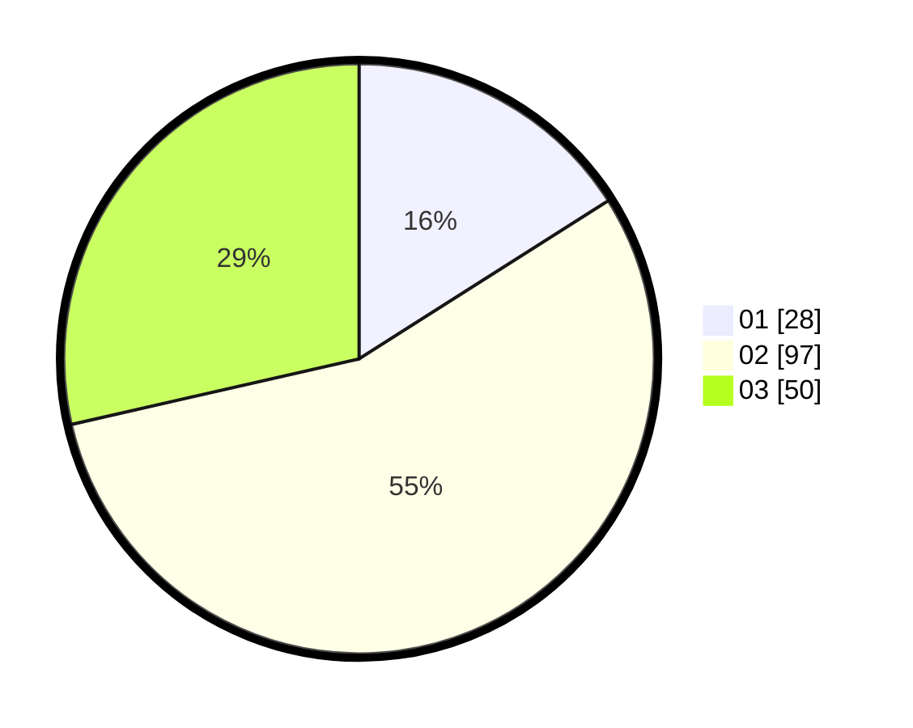

# Hasil

Hasil perolehan suara paslon dapat dilihat pada file paslon-01.txt, paslon-02.txt, dan paslon-03.txt.

Jika tidak ada, artinya data tersebut belum ada pada SIREKAP.

## Perolehan Suara

 * Paslon 01: **28**.
 * Paslon 02: **97**.
 * Paslon 03: **50**.

## Foto C Plano

https://sirekap-obj-formc.kpu.go.id/3380/pemilu/ppwp/31/71/02/10/04/3171021004041-20240214-195213--95e1b4ba-143b-45af-aee3-17c2714dd550.jpg

https://sirekap-obj-formc.kpu.go.id/3380/pemilu/ppwp/31/71/02/10/04/3171021004041-20240214-195528--e9f3d282-b58a-4249-8c66-56d0513f4665.jpg

https://sirekap-obj-formc.kpu.go.id/3380/pemilu/ppwp/31/71/02/10/04/3171021004041-20240214-195437--4d890a7f-322f-4d0f-afc5-9c93111c7d81.jpg

## DATA PEMILIH TETAP

Jumlah pemilih dalam DPT: **248**.
 * L: **120**.
 * P: **128**.

## DATA PENGGUNA HAK PILIH

Jumlah pengguna hak pilih dalam DPT: **172**.
 * L: **87**.
 * P: **85**.

Jumlah pengguna hak pilih dalam DPTb: **6**.
 * L: **3**.
 * P: **3**.

Jumlah pengguna hak pilih dalam DPK: **0**.
 * L: **0**.
 * P: **0**.

Jumlah pengguna hak pilih: **178**.
 * L: **90**.
 * P: **88**.

## JUMLAH SUARA SAH DAN TIDAK SAH

JUMLAH SELURUH SUARA SAH: **175**.

JUMLAH SUARA TIDAK SAH: **3**.

JUMLAH SELURUH SUARA SAH DAN SUARA TIDAK SAH: **178**.
