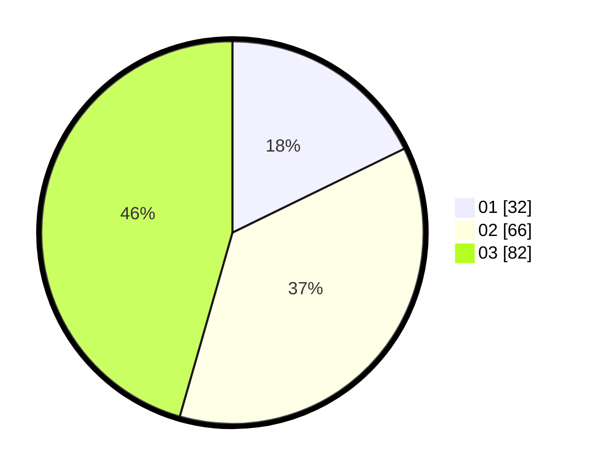

# Hasil

Hasil perolehan suara paslon dapat dilihat pada file paslon-01.txt, paslon-02.txt, dan paslon-03.txt.

Jika tidak ada, artinya data tersebut belum ada pada SIREKAP.

## Perolehan Suara

 * Paslon 01: **32**.
 * Paslon 02: **66**.
 * Paslon 03: **82**.

## Foto C Plano

https://sirekap-obj-formc.kpu.go.id/45ff/pemilu/ppwp/31/71/02/10/04/3171021004043-20240215-033259--b1c833cb-4f66-4619-af86-124afb622796.jpg

https://sirekap-obj-formc.kpu.go.id/45ff/pemilu/ppwp/31/71/02/10/04/3171021004043-20240215-033310--020a2394-b4b1-416b-aa43-00bf323dcf52.jpg

https://sirekap-obj-formc.kpu.go.id/45ff/pemilu/ppwp/31/71/02/10/04/3171021004043-20240214-155508--6f823ca0-cdbe-4afe-a7ad-d42046b0df11.jpg

## DATA PEMILIH TETAP

Jumlah pemilih dalam DPT: **270**.
 * L: **128**.
 * P: **142**.

## DATA PENGGUNA HAK PILIH

Jumlah pengguna hak pilih dalam DPT: **180**.
 * L: **81**.
 * P: **99**.

Jumlah pengguna hak pilih dalam DPTb: **5**.
 * L: **3**.
 * P: **2**.

Jumlah pengguna hak pilih dalam DPK: **0**.
 * L: **0**.
 * P: **0**.

Jumlah pengguna hak pilih: **185**.
 * L: **84**.
 * P: **101**.

## JUMLAH SUARA SAH DAN TIDAK SAH

JUMLAH SELURUH SUARA SAH: **180**.

JUMLAH SUARA TIDAK SAH: **5**.

JUMLAH SELURUH SUARA SAH DAN SUARA TIDAK SAH: **185**.
