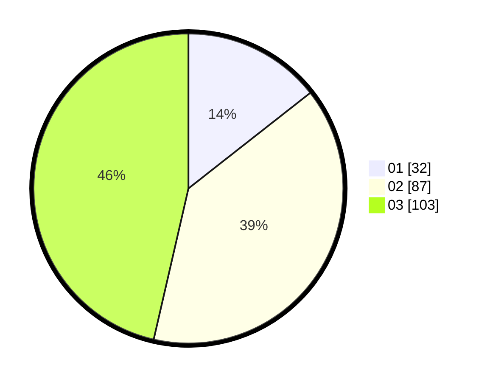

# Hasil

Hasil perolehan suara paslon dapat dilihat pada file paslon-01.txt, paslon-02.txt, dan paslon-03.txt.

Jika tidak ada, artinya data tersebut belum ada pada SIREKAP.

## Perolehan Suara

 * Paslon 01: **32**.
 * Paslon 02: **87**.
 * Paslon 03: **103**.

## Foto C Plano

https://sirekap-obj-formc.kpu.go.id/d795/pemilu/ppwp/31/71/02/10/04/3171021004047-20240216-152900--2b1acb0f-b073-4042-be45-de3fd89e3189.jpg

https://sirekap-obj-formc.kpu.go.id/d795/pemilu/ppwp/31/71/02/10/04/3171021004047-20240216-152902--3f39d1fe-a0bb-438c-a508-f28e8134c263.jpg

https://sirekap-obj-formc.kpu.go.id/d795/pemilu/ppwp/31/71/02/10/04/3171021004047-20240216-152901--dc04b577-e762-402e-a3d6-1777f9a307cc.jpg

## DATA PEMILIH TETAP

Jumlah pemilih dalam DPT: **278**.
 * L: **129**.
 * P: **149**.

## DATA PENGGUNA HAK PILIH

Jumlah pengguna hak pilih dalam DPT: **219**.
 * L: **95**.
 * P: **124**.

Jumlah pengguna hak pilih dalam DPTb: **6**.
 * L: **2**.
 * P: **4**.

Jumlah pengguna hak pilih dalam DPK: **0**.
 * L: **0**.
 * P: **0**.

Jumlah pengguna hak pilih: **225**.
 * L: **97**.
 * P: **128**.

## JUMLAH SUARA SAH DAN TIDAK SAH

JUMLAH SELURUH SUARA SAH: **222**.

JUMLAH SUARA TIDAK SAH: **3**.

JUMLAH SELURUH SUARA SAH DAN SUARA TIDAK SAH: **225**.
