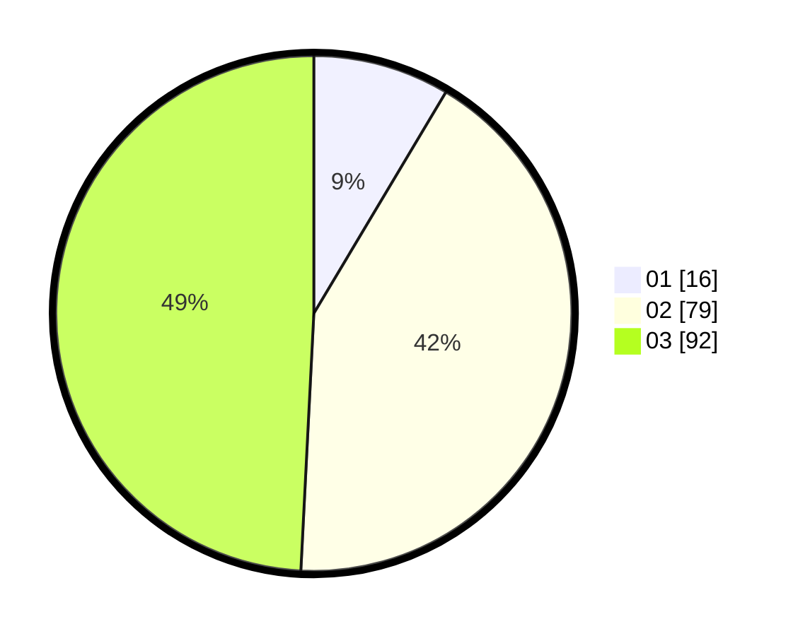

# Hasil

Hasil perolehan suara paslon dapat dilihat pada file paslon-01.txt, paslon-02.txt, dan paslon-03.txt.

Jika tidak ada, artinya data tersebut belum ada pada SIREKAP.

## Perolehan Suara

 * Paslon 01: **16**.
 * Paslon 02: **79**.
 * Paslon 03: **92**.

## Foto C Plano

https://sirekap-obj-formc.kpu.go.id/e470/pemilu/ppwp/31/71/02/10/04/3171021004048-20240216-164108--89ec6363-056e-4b77-a3a9-b24d6eaead25.jpg

https://sirekap-obj-formc.kpu.go.id/e470/pemilu/ppwp/31/71/02/10/04/3171021004048-20240216-164109--9297a7ef-0fc7-4d60-836f-38a0561bb291.jpg

https://sirekap-obj-formc.kpu.go.id/e470/pemilu/ppwp/31/71/02/10/04/3171021004048-20240216-164108--34ba0952-b0c7-443d-ad2b-79cd573d8cfa.jpg

## DATA PEMILIH TETAP

Jumlah pemilih dalam DPT: **287**.
 * L: **133**.
 * P: **154**.

## DATA PENGGUNA HAK PILIH

Jumlah pengguna hak pilih dalam DPT: **186**.
 * L: **85**.
 * P: **101**.

Jumlah pengguna hak pilih dalam DPTb: **2**.
 * L: **2**.
 * P: **0**.

Jumlah pengguna hak pilih dalam DPK: **2**.
 * L: **2**.
 * P: **0**.

Jumlah pengguna hak pilih: **190**.
 * L: **89**.
 * P: **101**.

## JUMLAH SUARA SAH DAN TIDAK SAH

JUMLAH SELURUH SUARA SAH: **187**.

JUMLAH SUARA TIDAK SAH: **3**.

JUMLAH SELURUH SUARA SAH DAN SUARA TIDAK SAH: **190**.
