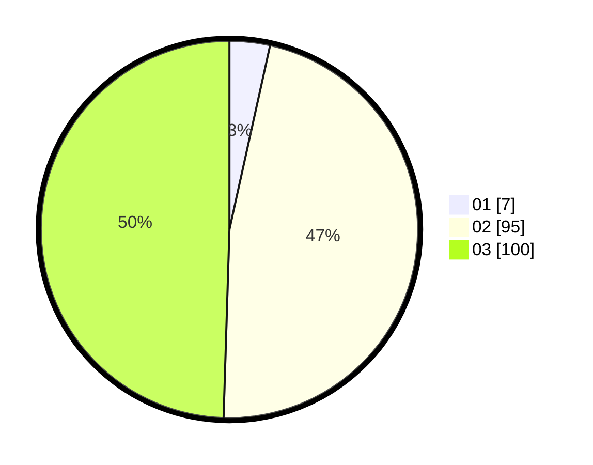

# Hasil

Hasil perolehan suara paslon dapat dilihat pada file paslon-01.txt, paslon-02.txt, dan paslon-03.txt.

Jika tidak ada, artinya data tersebut belum ada pada SIREKAP.

## Perolehan Suara

 * Paslon 01: **7**.
 * Paslon 02: **95**.
 * Paslon 03: **100**.

## Foto C Plano

https://sirekap-obj-formc.kpu.go.id/5249/pemilu/ppwp/31/71/02/10/04/3171021004049-20240214-191636--3e42d347-175d-4d87-9d89-ef66bed53e48.jpg

https://sirekap-obj-formc.kpu.go.id/5249/pemilu/ppwp/31/71/02/10/04/3171021004049-20240214-223954--f9ad71f9-2837-4581-a010-e0ccd35d03dd.jpg

https://sirekap-obj-formc.kpu.go.id/5249/pemilu/ppwp/31/71/02/10/04/3171021004049-20240214-223802--4655455b-c2fc-4af6-93ad-616a6dd51315.jpg

## DATA PEMILIH TETAP

Jumlah pemilih dalam DPT: **274**.
 * L: **118**.
 * P: **156**.

## DATA PENGGUNA HAK PILIH

Jumlah pengguna hak pilih dalam DPT: **192**.
 * L: **81**.
 * P: **111**.

Jumlah pengguna hak pilih dalam DPTb: **8**.
 * L: **1**.
 * P: **7**.

Jumlah pengguna hak pilih dalam DPK: **2**.
 * L: **1**.
 * P: **1**.

Jumlah pengguna hak pilih: **202**.
 * L: **83**.
 * P: **119**.

## JUMLAH SUARA SAH DAN TIDAK SAH

JUMLAH SELURUH SUARA SAH: **202**.

JUMLAH SUARA TIDAK SAH: **0**.

JUMLAH SELURUH SUARA SAH DAN SUARA TIDAK SAH: **202**.
