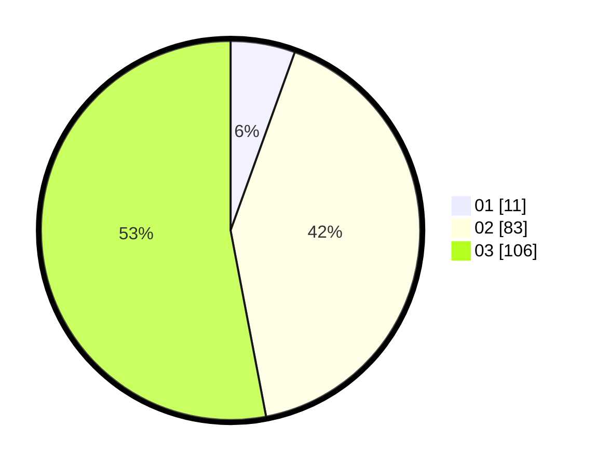

# Hasil

Hasil perolehan suara paslon dapat dilihat pada file paslon-01.txt, paslon-02.txt, dan paslon-03.txt.

Jika tidak ada, artinya data tersebut belum ada pada SIREKAP.

## Perolehan Suara

 * Paslon 01: **11**.
 * Paslon 02: **83**.
 * Paslon 03: **106**.

## Foto C Plano

https://sirekap-obj-formc.kpu.go.id/5d3b/pemilu/ppwp/31/71/02/10/04/3171021004050-20240216-022940--30d41d23-96fb-4f04-95eb-8fef101614f3.jpg

https://sirekap-obj-formc.kpu.go.id/5d3b/pemilu/ppwp/31/71/02/10/04/3171021004050-20240216-020430--88c3b4bb-5c6b-4531-9a8e-e6949bcd3122.jpg

https://sirekap-obj-formc.kpu.go.id/5d3b/pemilu/ppwp/31/71/02/10/04/3171021004050-20240216-022941--966b2f5e-c8ee-4b43-9905-7f313fb38276.jpg

## DATA PEMILIH TETAP

Jumlah pemilih dalam DPT: **262**.
 * L: **133**.
 * P: **129**.

## DATA PENGGUNA HAK PILIH

Jumlah pengguna hak pilih dalam DPT: **195**.
 * L: **98**.
 * P: **97**.

Jumlah pengguna hak pilih dalam DPTb: **5**.
 * L: **3**.
 * P: **2**.

Jumlah pengguna hak pilih dalam DPK: **1**.
 * L: **1**.
 * P: **0**.

Jumlah pengguna hak pilih: **201**.
 * L: **102**.
 * P: **99**.

## JUMLAH SUARA SAH DAN TIDAK SAH

JUMLAH SELURUH SUARA SAH: **200**.

JUMLAH SUARA TIDAK SAH: **1**.

JUMLAH SELURUH SUARA SAH DAN SUARA TIDAK SAH: **201**.
