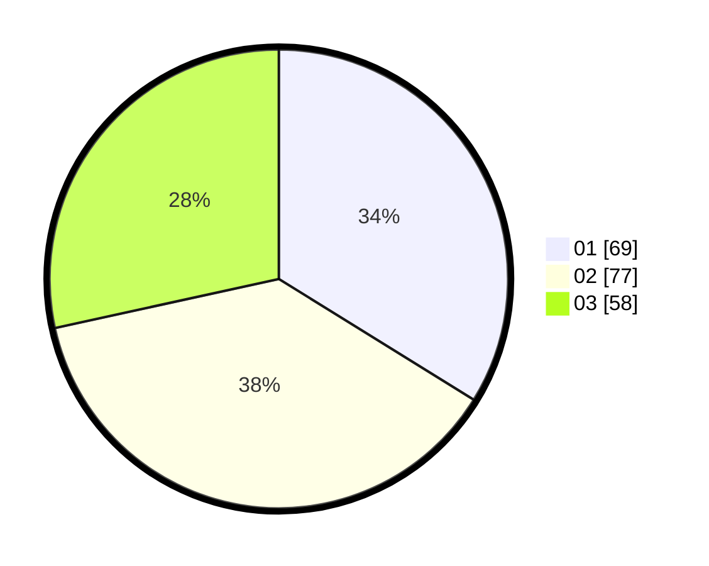

# Hasil

Hasil perolehan suara paslon dapat dilihat pada file paslon-01.txt, paslon-02.txt, dan paslon-03.txt.

Jika tidak ada, artinya data tersebut belum ada pada SIREKAP.

## Perolehan Suara

 * Paslon 01: **69**.
 * Paslon 02: **77**.
 * Paslon 03: **58**.

## Foto C Plano

https://sirekap-obj-formc.kpu.go.id/fdf0/pemilu/ppwp/31/71/02/10/04/3171021004054-20240214-155610--8aaec85b-96b8-475d-a8d0-8ab3fdc61a29.jpg

https://sirekap-obj-formc.kpu.go.id/fdf0/pemilu/ppwp/31/71/02/10/04/3171021004054-20240214-155710--011618de-ddfb-47c6-a793-6b4430160e57.jpg

https://sirekap-obj-formc.kpu.go.id/fdf0/pemilu/ppwp/31/71/02/10/04/3171021004054-20240214-155830--92c80dc1-755a-4d60-9167-fdc976e45c23.jpg

## DATA PEMILIH TETAP

Jumlah pemilih dalam DPT: **261**.
 * L: **120**.
 * P: **141**.

## DATA PENGGUNA HAK PILIH

Jumlah pengguna hak pilih dalam DPT: **200**.
 * L: **86**.
 * P: **114**.

Jumlah pengguna hak pilih dalam DPTb: **5**.
 * L: **2**.
 * P: **3**.

Jumlah pengguna hak pilih dalam DPK: **2**.
 * L: **2**.
 * P: **0**.

Jumlah pengguna hak pilih: **207**.
 * L: **90**.
 * P: **117**.

## JUMLAH SUARA SAH DAN TIDAK SAH

JUMLAH SELURUH SUARA SAH: **204**.

JUMLAH SUARA TIDAK SAH: **3**.

JUMLAH SELURUH SUARA SAH DAN SUARA TIDAK SAH: **207**.
