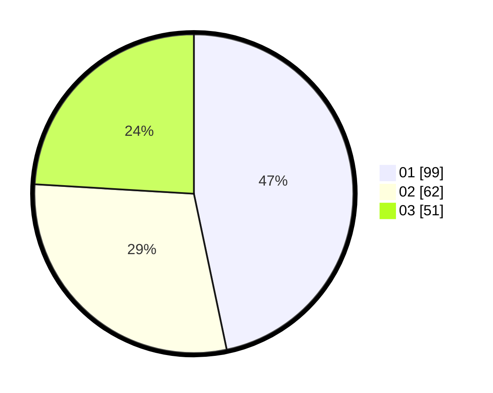

# Hasil

Hasil perolehan suara paslon dapat dilihat pada file paslon-01.txt, paslon-02.txt, dan paslon-03.txt.

Jika tidak ada, artinya data tersebut belum ada pada SIREKAP.

## Perolehan Suara

 * Paslon 01: **99**.
 * Paslon 02: **62**.
 * Paslon 03: **51**.

## Foto C Plano

https://sirekap-obj-formc.kpu.go.id/d6a7/pemilu/ppwp/31/71/02/10/04/3171021004056-20240217-114056--e058776c-eef1-4cfa-a445-13095c750e39.jpg

https://sirekap-obj-formc.kpu.go.id/d6a7/pemilu/ppwp/31/71/02/10/04/3171021004056-20240217-114057--1ac73530-efc1-4a19-a028-34a0578bec64.jpg

https://sirekap-obj-formc.kpu.go.id/d6a7/pemilu/ppwp/31/71/02/10/04/3171021004056-20240217-114056--1c7d6b73-20ba-42dd-9dbe-72c72f7223ae.jpg

## DATA PEMILIH TETAP

Jumlah pemilih dalam DPT: **252**.
 * L: **122**.
 * P: **130**.

## DATA PENGGUNA HAK PILIH

Jumlah pengguna hak pilih dalam DPT: **196**.
 * L: **88**.
 * P: **108**.

Jumlah pengguna hak pilih dalam DPTb: **15**.
 * L: **5**.
 * P: **10**.

Jumlah pengguna hak pilih dalam DPK: **3**.
 * L: **1**.
 * P: **2**.

Jumlah pengguna hak pilih: **214**.
 * L: **94**.
 * P: **120**.

## JUMLAH SUARA SAH DAN TIDAK SAH

JUMLAH SELURUH SUARA SAH: **212**.

JUMLAH SUARA TIDAK SAH: **2**.

JUMLAH SELURUH SUARA SAH DAN SUARA TIDAK SAH: **214**.
