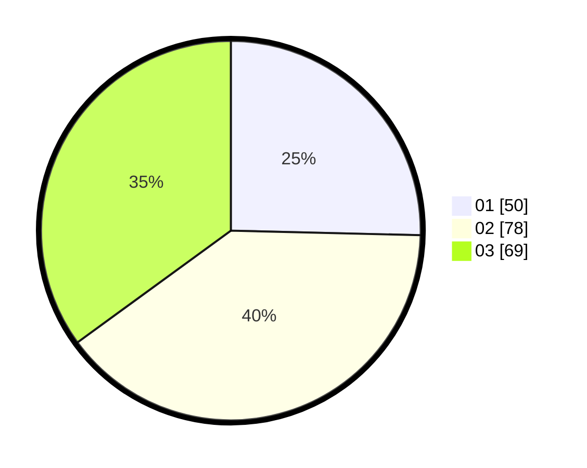

# Hasil

Hasil perolehan suara paslon dapat dilihat pada file paslon-01.txt, paslon-02.txt, dan paslon-03.txt.

Jika tidak ada, artinya data tersebut belum ada pada SIREKAP.

## Perolehan Suara

 * Paslon 01: **50**.
 * Paslon 02: **78**.
 * Paslon 03: **69**.

## Foto C Plano

https://sirekap-obj-formc.kpu.go.id/ac14/pemilu/ppwp/31/71/02/10/04/3171021004058-20240214-184555--5ad9a13f-a5ae-4233-9f9f-11e17ba2b142.jpg

https://sirekap-obj-formc.kpu.go.id/ac14/pemilu/ppwp/31/71/02/10/04/3171021004058-20240214-184519--9e78cc29-485c-4b27-99db-bca6ef565ae8.jpg

https://sirekap-obj-formc.kpu.go.id/ac14/pemilu/ppwp/31/71/02/10/04/3171021004058-20240214-184528--e059b993-cd84-4989-96c2-625c12cfa531.jpg

## DATA PEMILIH TETAP

Jumlah pemilih dalam DPT: **232**.
 * L: **98**.
 * P: **134**.

## DATA PENGGUNA HAK PILIH

Jumlah pengguna hak pilih dalam DPT: **181**.
 * L: **77**.
 * P: **104**.

Jumlah pengguna hak pilih dalam DPTb: **16**.
 * L: **5**.
 * P: **11**.

Jumlah pengguna hak pilih dalam DPK: **5**.
 * L: **2**.
 * P: **3**.

Jumlah pengguna hak pilih: **202**.
 * L: **84**.
 * P: **118**.

## JUMLAH SUARA SAH DAN TIDAK SAH

JUMLAH SELURUH SUARA SAH: **197**.

JUMLAH SUARA TIDAK SAH: **5**.

JUMLAH SELURUH SUARA SAH DAN SUARA TIDAK SAH: **202**.
