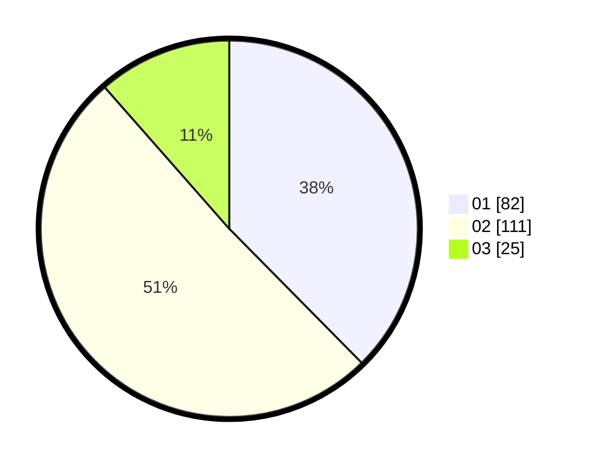

# Hasil

Hasil perolehan suara paslon dapat dilihat pada file paslon-01.txt, paslon-02.txt, dan paslon-03.txt.

Jika tidak ada, artinya data tersebut belum ada pada SIREKAP.

## Perolehan Suara

 * Paslon 01: **82**.
 * Paslon 02: **111**.
 * Paslon 03: **25**.

## Foto C Plano

https://sirekap-obj-formc.kpu.go.id/f564/pemilu/ppwp/31/71/02/10/05/3171021005003-20240214-231617--d79ddd1a-5ea4-48b6-9f44-f08c3de6459d.jpg

https://sirekap-obj-formc.kpu.go.id/f564/pemilu/ppwp/31/71/02/10/05/3171021005003-20240214-232314--1e18f833-4f8e-4332-85d9-af76b52baa96.jpg

https://sirekap-obj-formc.kpu.go.id/f564/pemilu/ppwp/31/71/02/10/05/3171021005003-20240214-232515--d598293f-5752-454f-8981-1e07f66d1254.jpg

## DATA PEMILIH TETAP

Jumlah pemilih dalam DPT: **284**.
 * L: **153**.
 * P: **131**.

## DATA PENGGUNA HAK PILIH

Jumlah pengguna hak pilih dalam DPT: **205**.
 * L: **107**.
 * P: **98**.

Jumlah pengguna hak pilih dalam DPTb: **17**.
 * L: **9**.
 * P: **8**.

Jumlah pengguna hak pilih dalam DPK: **1**.
 * L: **1**.
 * P: **0**.

Jumlah pengguna hak pilih: **223**.
 * L: **117**.
 * P: **106**.

## JUMLAH SUARA SAH DAN TIDAK SAH

JUMLAH SELURUH SUARA SAH: **218**.

JUMLAH SUARA TIDAK SAH: **5**.

JUMLAH SELURUH SUARA SAH DAN SUARA TIDAK SAH: **223**.
