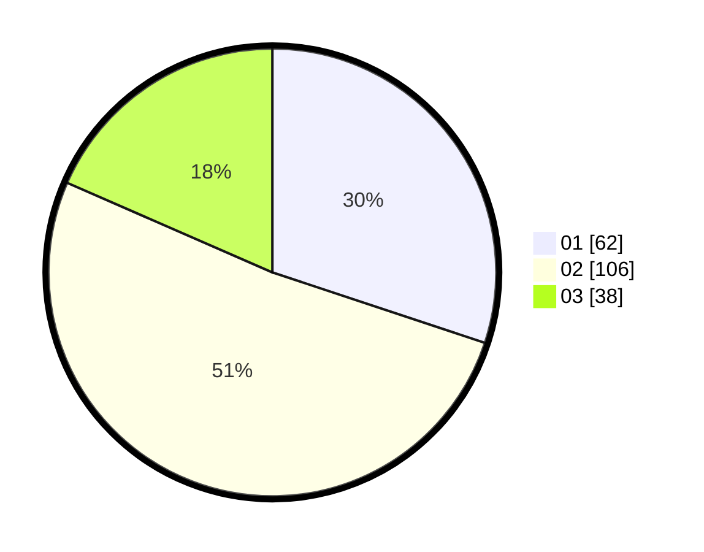

# Hasil

Hasil perolehan suara paslon dapat dilihat pada file paslon-01.txt, paslon-02.txt, dan paslon-03.txt.

Jika tidak ada, artinya data tersebut belum ada pada SIREKAP.

## Perolehan Suara

 * Paslon 01: **62**.
 * Paslon 02: **106**.
 * Paslon 03: **38**.

## Foto C Plano

https://sirekap-obj-formc.kpu.go.id/0724/pemilu/ppwp/31/71/02/10/05/3171021005006-20240214-194349--8ef4f5a2-5e85-4212-abb7-ccf32e24f043.jpg

https://sirekap-obj-formc.kpu.go.id/0724/pemilu/ppwp/31/71/02/10/05/3171021005006-20240214-201157--b181e137-9bfe-45e4-b4f8-73269d5c4d2a.jpg

https://sirekap-obj-formc.kpu.go.id/0724/pemilu/ppwp/31/71/02/10/05/3171021005006-20240214-214941--1c8d2dbf-df6a-4f83-9617-46a8978d2104.jpg

## DATA PEMILIH TETAP

Jumlah pemilih dalam DPT: **284**.
 * L: **49**.
 * P: **635**.

## DATA PENGGUNA HAK PILIH

Jumlah pengguna hak pilih dalam DPT: **192**.
 * L: **90**.
 * P: **102**.

Jumlah pengguna hak pilih dalam DPTb: **14**.
 * L: **3**.
 * P: **11**.

Jumlah pengguna hak pilih dalam DPK: **1**.
 * L: **0**.
 * P: **1**.

Jumlah pengguna hak pilih: **207**.
 * L: **93**.
 * P: **114**.

## JUMLAH SUARA SAH DAN TIDAK SAH

JUMLAH SELURUH SUARA SAH: **206**.

JUMLAH SUARA TIDAK SAH: **1**.

JUMLAH SELURUH SUARA SAH DAN SUARA TIDAK SAH: **207**.
