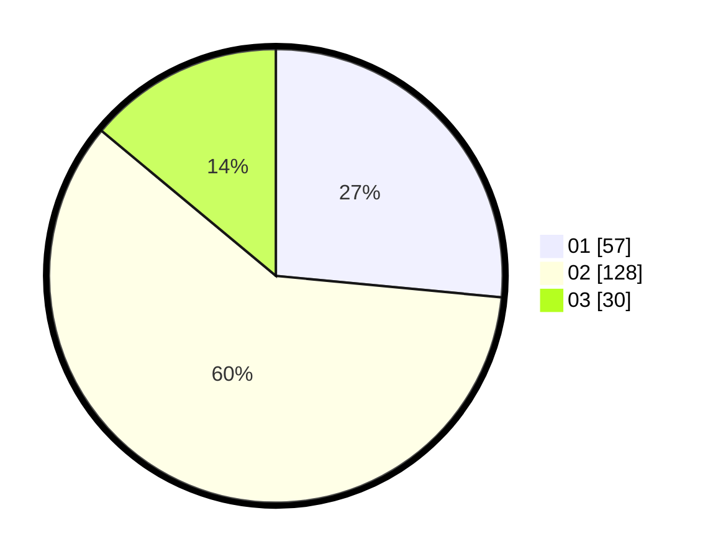

# Hasil

Hasil perolehan suara paslon dapat dilihat pada file paslon-01.txt, paslon-02.txt, dan paslon-03.txt.

Jika tidak ada, artinya data tersebut belum ada pada SIREKAP.

## Perolehan Suara

 * Paslon 01: **57**.
 * Paslon 02: **128**.
 * Paslon 03: **30**.

## Foto C Plano

https://sirekap-obj-formc.kpu.go.id/7d6c/pemilu/ppwp/31/71/02/10/05/3171021005007-20240214-215715--78dc1da8-dc8b-4bc0-9060-fb4584db4ab2.jpg

https://sirekap-obj-formc.kpu.go.id/7d6c/pemilu/ppwp/31/71/02/10/05/3171021005007-20240214-215351--a00ae092-204e-4ecf-82f9-2fa425179cfc.jpg

https://sirekap-obj-formc.kpu.go.id/7d6c/pemilu/ppwp/31/71/02/10/05/3171021005007-20240214-215441--8322ee49-1be0-4222-bb12-cd20b2d46783.jpg

## DATA PEMILIH TETAP

Jumlah pemilih dalam DPT: **286**.
 * L: **141**.
 * P: **145**.

## DATA PENGGUNA HAK PILIH

Jumlah pengguna hak pilih dalam DPT: **209**.
 * L: **95**.
 * P: **114**.

Jumlah pengguna hak pilih dalam DPTb: **12**.
 * L: **3**.
 * P: **9**.

Jumlah pengguna hak pilih dalam DPK: **1**.
 * L: **0**.
 * P: **1**.

Jumlah pengguna hak pilih: **222**.
 * L: **98**.
 * P: **124**.

## JUMLAH SUARA SAH DAN TIDAK SAH

JUMLAH SELURUH SUARA SAH: **215**.

JUMLAH SUARA TIDAK SAH: **7**.

JUMLAH SELURUH SUARA SAH DAN SUARA TIDAK SAH: **222**.
