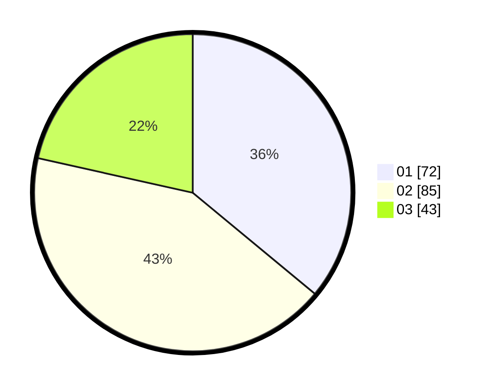

# Hasil

Hasil perolehan suara paslon dapat dilihat pada file paslon-01.txt, paslon-02.txt, dan paslon-03.txt.

Jika tidak ada, artinya data tersebut belum ada pada SIREKAP.

## Perolehan Suara

 * Paslon 01: **72**.
 * Paslon 02: **85**.
 * Paslon 03: **43**.

## Foto C Plano

https://sirekap-obj-formc.kpu.go.id/5200/pemilu/ppwp/31/71/02/10/05/3171021005011-20240214-234058--30b85a63-68ab-4db7-b393-f8d7b60a6546.jpg

https://sirekap-obj-formc.kpu.go.id/5200/pemilu/ppwp/31/71/02/10/05/3171021005011-20240215-002335--e667a161-3c3b-46b6-a378-f4020e61525b.jpg

https://sirekap-obj-formc.kpu.go.id/5200/pemilu/ppwp/31/71/02/10/05/3171021005011-20240215-001946--6ede19f7-bebe-40da-badd-d2c5f793aa8a.jpg
