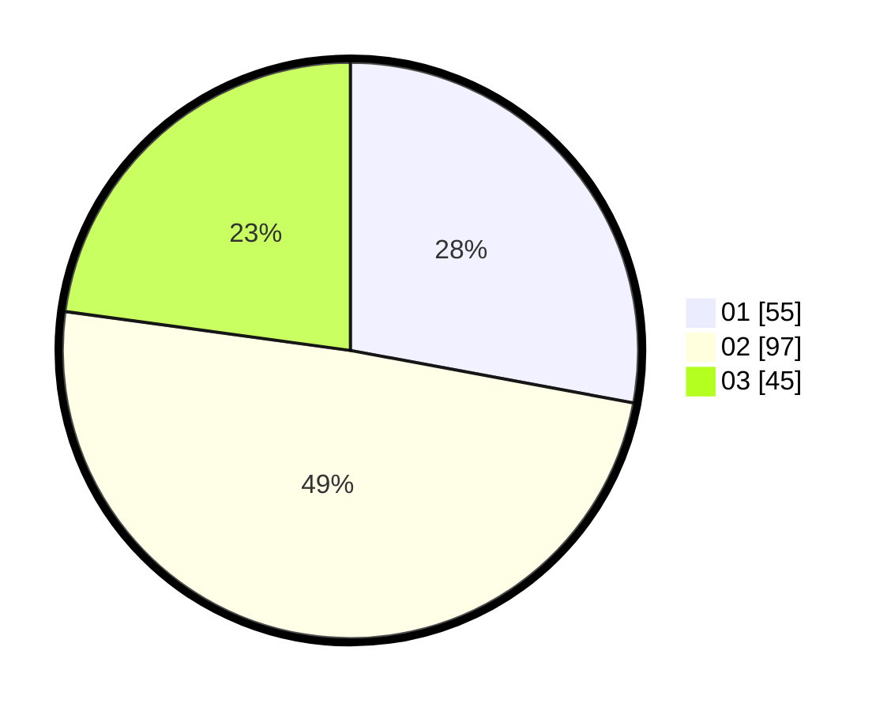

# Hasil

Hasil perolehan suara paslon dapat dilihat pada file paslon-01.txt, paslon-02.txt, dan paslon-03.txt.

Jika tidak ada, artinya data tersebut belum ada pada SIREKAP.

## Perolehan Suara

 * Paslon 01: **55**.
 * Paslon 02: **97**.
 * Paslon 03: **45**.

## Foto C Plano

https://sirekap-obj-formc.kpu.go.id/b15f/pemilu/ppwp/31/71/02/10/05/3171021005012-20240217-222127--13d55cb5-90fa-42b5-a763-dd6975dc30c8.jpg

https://sirekap-obj-formc.kpu.go.id/b15f/pemilu/ppwp/31/71/02/10/05/3171021005012-20240217-220810--77324cf6-a697-4998-af4b-5c182a182773.jpg

https://sirekap-obj-formc.kpu.go.id/b15f/pemilu/ppwp/31/71/02/10/05/3171021005012-20240217-222232--9ad67535-feee-4947-8dff-1ff0633ecb01.jpg

## DATA PEMILIH TETAP

Jumlah pemilih dalam DPT: **272**.
 * L: **123**.
 * P: **149**.

## DATA PENGGUNA HAK PILIH

Jumlah pengguna hak pilih dalam DPT: **192**.
 * L: **85**.
 * P: **107**.

Jumlah pengguna hak pilih dalam DPTb: **0**.
 * L: **0**.
 * P: **0**.

Jumlah pengguna hak pilih dalam DPK: **6**.
 * L: **4**.
 * P: **2**.

Jumlah pengguna hak pilih: **198**.
 * L: **89**.
 * P: **109**.

## JUMLAH SUARA SAH DAN TIDAK SAH

JUMLAH SELURUH SUARA SAH: **197**.

JUMLAH SUARA TIDAK SAH: **1**.

JUMLAH SELURUH SUARA SAH DAN SUARA TIDAK SAH: **198**.
