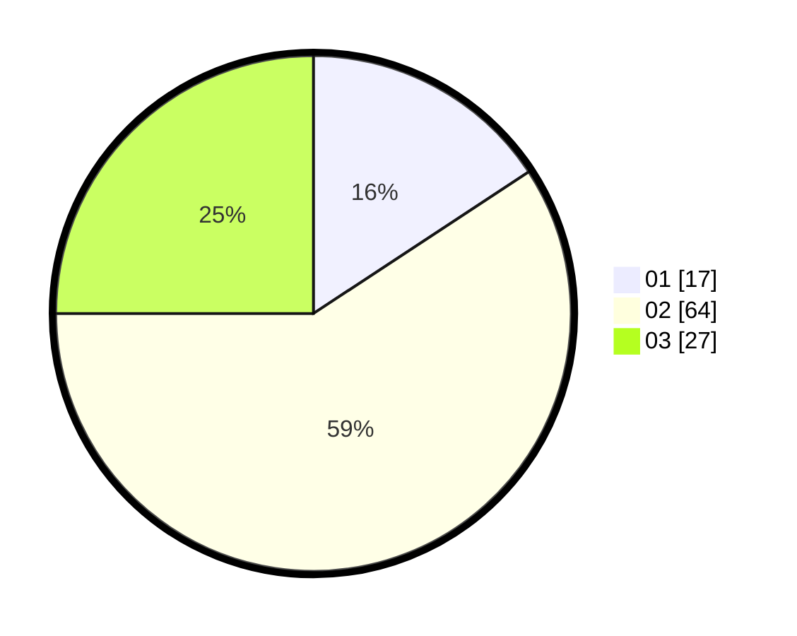

# Hasil

Hasil perolehan suara paslon dapat dilihat pada file paslon-01.txt, paslon-02.txt, dan paslon-03.txt.

Jika tidak ada, artinya data tersebut belum ada pada SIREKAP.

## Perolehan Suara

 * Paslon 01: **17**.
 * Paslon 02: **64**.
 * Paslon 03: **27**.

## Foto C Plano

https://sirekap-obj-formc.kpu.go.id/a4ec/pemilu/ppwp/31/71/02/10/05/3171021005015-20240218-181220--9164e994-e6ed-4744-95f2-034249938f2b.jpg

https://sirekap-obj-formc.kpu.go.id/a4ec/pemilu/ppwp/31/71/02/10/05/3171021005015-20240217-221023--79fdb65a-2213-433f-80ad-42764441126d.jpg

https://sirekap-obj-formc.kpu.go.id/a4ec/pemilu/ppwp/31/71/02/10/05/3171021005015-20240217-221115--b2216f3f-50e1-4fec-aaa1-d7d6ac9ae9c9.jpg

## DATA PEMILIH TETAP

Jumlah pemilih dalam DPT: **259**.
 * L: **118**.
 * P: **141**.

## DATA PENGGUNA HAK PILIH

Jumlah pengguna hak pilih dalam DPT: **108**.
 * L: **44**.
 * P: **64**.

Jumlah pengguna hak pilih dalam DPTb: **3**.
 * L: **3**.
 * P: **0**.

Jumlah pengguna hak pilih dalam DPK: **201**.
 * L: **1**.
 * P: **0**.

Jumlah pengguna hak pilih: **112**.
 * L: **48**.
 * P: **64**.

## JUMLAH SUARA SAH DAN TIDAK SAH

JUMLAH SELURUH SUARA SAH: **108**.

JUMLAH SUARA TIDAK SAH: **2**.

JUMLAH SELURUH SUARA SAH DAN SUARA TIDAK SAH: **112**.
