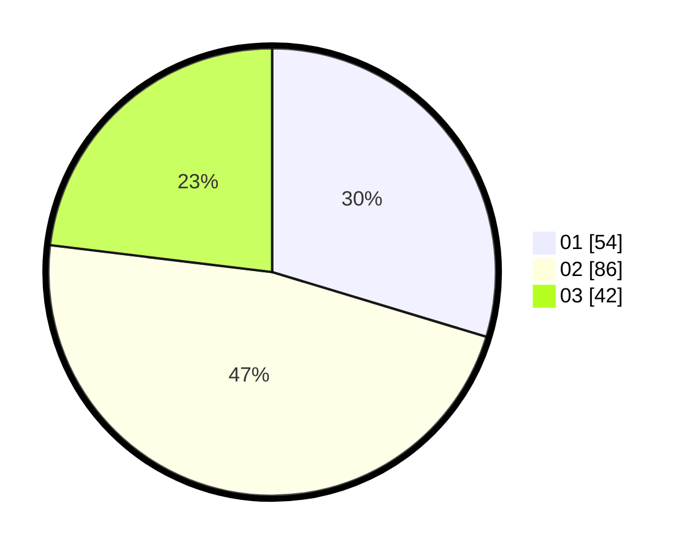

# Hasil

Hasil perolehan suara paslon dapat dilihat pada file paslon-01.txt, paslon-02.txt, dan paslon-03.txt.

Jika tidak ada, artinya data tersebut belum ada pada SIREKAP.

## Perolehan Suara

 * Paslon 01: **54**.
 * Paslon 02: **86**.
 * Paslon 03: **42**.

## Foto C Plano

https://sirekap-obj-formc.kpu.go.id/fc79/pemilu/ppwp/31/71/02/10/05/3171021005017-20240215-024622--14154fdd-169f-4298-8a7a-a1f716797f10.jpg

https://sirekap-obj-formc.kpu.go.id/fc79/pemilu/ppwp/31/71/02/10/05/3171021005017-20240215-024644--61ed66ad-0e39-4d68-8ec4-8546ad4e99d0.jpg

https://sirekap-obj-formc.kpu.go.id/fc79/pemilu/ppwp/31/71/02/10/05/3171021005017-20240215-024633--10d3100e-1d10-47d4-a690-722af11fd23d.jpg

## DATA PEMILIH TETAP

Jumlah pemilih dalam DPT: **275**.
 * L: **149**.
 * P: **126**.

## DATA PENGGUNA HAK PILIH

Jumlah pengguna hak pilih dalam DPT: **177**.
 * L: **97**.
 * P: **80**.

Jumlah pengguna hak pilih dalam DPTb: **6**.
 * L: **4**.
 * P: **2**.

Jumlah pengguna hak pilih dalam DPK: **0**.
 * L: **0**.
 * P: **0**.

Jumlah pengguna hak pilih: **183**.
 * L: **101**.
 * P: **82**.

## JUMLAH SUARA SAH DAN TIDAK SAH

JUMLAH SELURUH SUARA SAH: **182**.

JUMLAH SUARA TIDAK SAH: **1**.

JUMLAH SELURUH SUARA SAH DAN SUARA TIDAK SAH: **183**.
