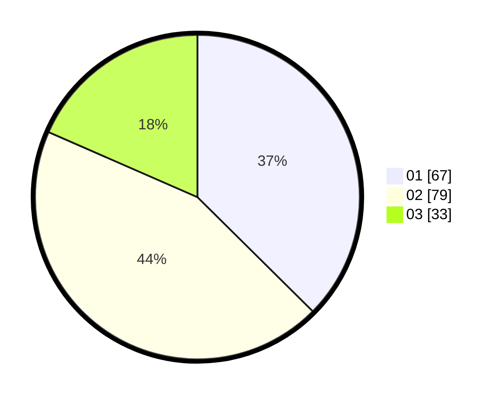

# Hasil

Hasil perolehan suara paslon dapat dilihat pada file paslon-01.txt, paslon-02.txt, dan paslon-03.txt.

Jika tidak ada, artinya data tersebut belum ada pada SIREKAP.

## Perolehan Suara

 * Paslon 01: **67**.
 * Paslon 02: **79**.
 * Paslon 03: **33**.

## Foto C Plano

https://sirekap-obj-formc.kpu.go.id/2668/pemilu/ppwp/31/71/02/10/05/3171021005021-20240214-160112--dc7eb32b-06c1-44f6-a571-d0159ce5881f.jpg

https://sirekap-obj-formc.kpu.go.id/2668/pemilu/ppwp/31/71/02/10/05/3171021005021-20240214-155419--3c3353a2-9d0e-4ff5-87bc-affe61c018f6.jpg

https://sirekap-obj-formc.kpu.go.id/2668/pemilu/ppwp/31/71/02/10/05/3171021005021-20240214-155753--021c5a8d-672f-4187-b684-a765f06d3159.jpg

## DATA PEMILIH TETAP

Jumlah pemilih dalam DPT: **289**.
 * L: **140**.
 * P: **149**.

## DATA PENGGUNA HAK PILIH

Jumlah pengguna hak pilih dalam DPT: **165**.
 * L: **85**.
 * P: **80**.

Jumlah pengguna hak pilih dalam DPTb: **13**.
 * L: **7**.
 * P: **6**.

Jumlah pengguna hak pilih dalam DPK: **2**.
 * L: **1**.
 * P: **1**.

Jumlah pengguna hak pilih: **180**.
 * L: **93**.
 * P: **87**.

## JUMLAH SUARA SAH DAN TIDAK SAH

JUMLAH SELURUH SUARA SAH: **179**.

JUMLAH SUARA TIDAK SAH: **1**.

JUMLAH SELURUH SUARA SAH DAN SUARA TIDAK SAH: **180**.
