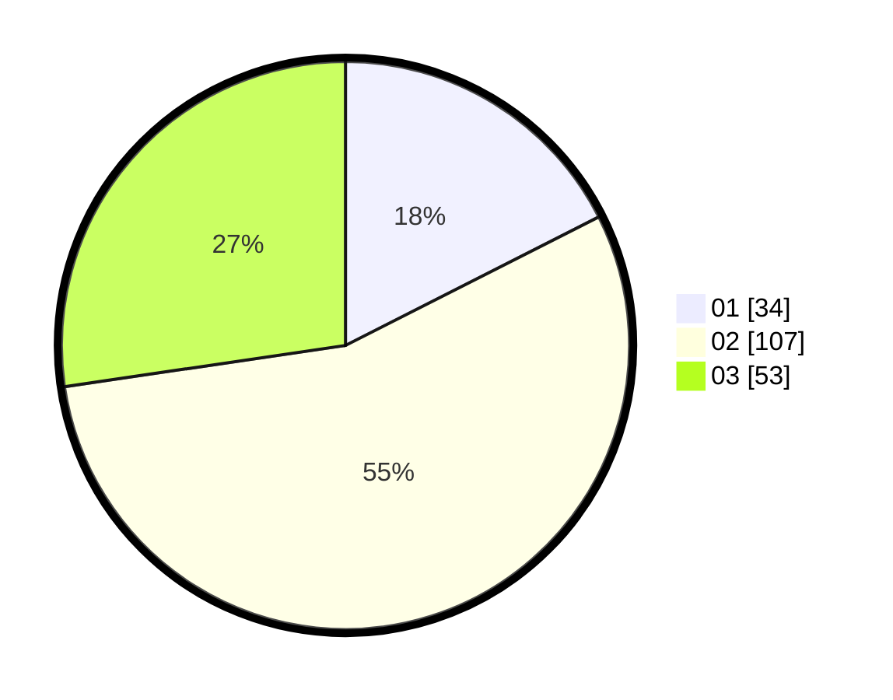

# Hasil

Hasil perolehan suara paslon dapat dilihat pada file paslon-01.txt, paslon-02.txt, dan paslon-03.txt.

Jika tidak ada, artinya data tersebut belum ada pada SIREKAP.

## Perolehan Suara

 * Paslon 01: **34**.
 * Paslon 02: **107**.
 * Paslon 03: **53**.

## Foto C Plano

https://sirekap-obj-formc.kpu.go.id/6fad/pemilu/ppwp/31/71/02/10/05/3171021005023-20240214-155309--b8b8c840-6470-486d-a5ac-25ed75556aa6.jpg

https://sirekap-obj-formc.kpu.go.id/6fad/pemilu/ppwp/31/71/02/10/05/3171021005023-20240214-155357--39ce90e9-ed3a-4e27-9c3b-d408ee98a050.jpg

https://sirekap-obj-formc.kpu.go.id/6fad/pemilu/ppwp/31/71/02/10/05/3171021005023-20240214-155445--ea79b251-1e5b-4361-8341-cbe1ca4629e5.jpg

## DATA PEMILIH TETAP

Jumlah pemilih dalam DPT: **287**.
 * L: **143**.
 * P: **144**.

## DATA PENGGUNA HAK PILIH

Jumlah pengguna hak pilih dalam DPT: **192**.
 * L: **91**.
 * P: **101**.

Jumlah pengguna hak pilih dalam DPTb: **7**.
 * L: **3**.
 * P: **4**.

Jumlah pengguna hak pilih dalam DPK: **0**.
 * L: **0**.
 * P: **0**.

Jumlah pengguna hak pilih: **199**.
 * L: **94**.
 * P: **105**.

## JUMLAH SUARA SAH DAN TIDAK SAH

JUMLAH SELURUH SUARA SAH: **194**.

JUMLAH SUARA TIDAK SAH: **5**.

JUMLAH SELURUH SUARA SAH DAN SUARA TIDAK SAH: **199**.
