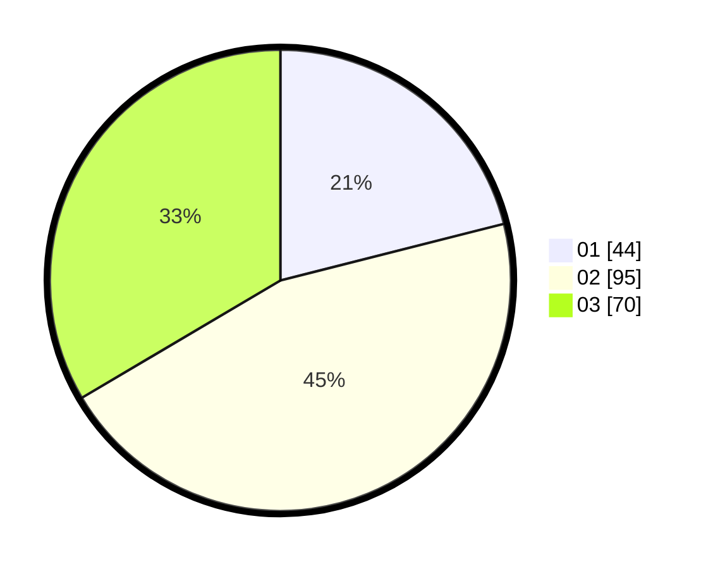

# Hasil

Hasil perolehan suara paslon dapat dilihat pada file paslon-01.txt, paslon-02.txt, dan paslon-03.txt.

Jika tidak ada, artinya data tersebut belum ada pada SIREKAP.

## Perolehan Suara

 * Paslon 01: **44**.
 * Paslon 02: **95**.
 * Paslon 03: **70**.

## Foto C Plano

https://sirekap-obj-formc.kpu.go.id/2a89/pemilu/ppwp/31/71/02/10/05/3171021005024-20240216-182600--361131cf-5aa7-49fc-963b-da4944a15284.jpg

https://sirekap-obj-formc.kpu.go.id/2a89/pemilu/ppwp/31/71/02/10/05/3171021005024-20240216-182601--a64f4369-f44b-4003-9b70-4195cac99706.jpg

https://sirekap-obj-formc.kpu.go.id/2a89/pemilu/ppwp/31/71/02/10/05/3171021005024-20240216-182601--0e0fc18d-42ab-45ca-90e2-90f69b4a74d0.jpg

## DATA PEMILIH TETAP

Jumlah pemilih dalam DPT: **289**.
 * L: **173**.
 * P: **116**.

## DATA PENGGUNA HAK PILIH

Jumlah pengguna hak pilih dalam DPT: **208**.
 * L: **92**.
 * P: **116**.

Jumlah pengguna hak pilih dalam DPTb: **1**.
 * L: **0**.
 * P: **1**.

Jumlah pengguna hak pilih dalam DPK: **4**.
 * L: **2**.
 * P: **2**.

Jumlah pengguna hak pilih: **213**.
 * L: **94**.
 * P: **119**.

## JUMLAH SUARA SAH DAN TIDAK SAH

JUMLAH SELURUH SUARA SAH: **209**.

JUMLAH SUARA TIDAK SAH: **4**.

JUMLAH SELURUH SUARA SAH DAN SUARA TIDAK SAH: **213**.
