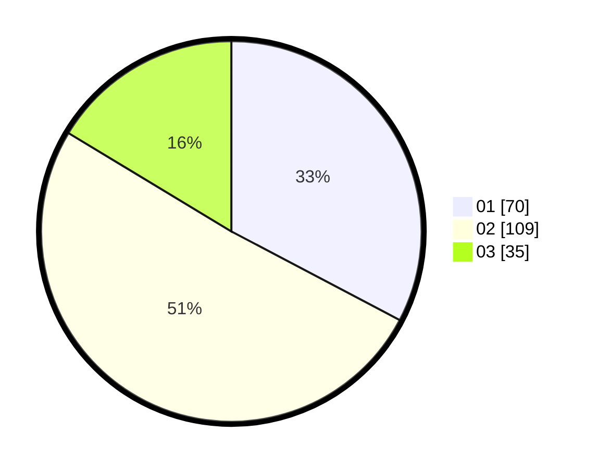

# Hasil

Hasil perolehan suara paslon dapat dilihat pada file paslon-01.txt, paslon-02.txt, dan paslon-03.txt.

Jika tidak ada, artinya data tersebut belum ada pada SIREKAP.

## Perolehan Suara

 * Paslon 01: **70**.
 * Paslon 02: **109**.
 * Paslon 03: **35**.

## Foto C Plano

https://sirekap-obj-formc.kpu.go.id/a3fa/pemilu/ppwp/31/71/02/10/05/3171021005029-20240214-213322--df79f8eb-ea40-445a-a481-3c4e52c929e5.jpg

https://sirekap-obj-formc.kpu.go.id/a3fa/pemilu/ppwp/31/71/02/10/05/3171021005029-20240214-212157--b84851ab-05a7-407c-81c6-58ee60952856.jpg

https://sirekap-obj-formc.kpu.go.id/a3fa/pemilu/ppwp/31/71/02/10/05/3171021005029-20240214-212705--6f015037-1aac-414a-ac75-fe8d8574d611.jpg

## DATA PEMILIH TETAP

Jumlah pemilih dalam DPT: **279**.
 * L: **141**.
 * P: **138**.

## DATA PENGGUNA HAK PILIH

Jumlah pengguna hak pilih dalam DPT: **219**.
 * L: **110**.
 * P: **109**.

Jumlah pengguna hak pilih dalam DPTb: **0**.
 * L: **0**.
 * P: **0**.

Jumlah pengguna hak pilih dalam DPK: **1**.
 * L: **0**.
 * P: **1**.

Jumlah pengguna hak pilih: **220**.
 * L: **110**.
 * P: **110**.

## JUMLAH SUARA SAH DAN TIDAK SAH

JUMLAH SELURUH SUARA SAH: **214**.

JUMLAH SUARA TIDAK SAH: **6**.

JUMLAH SELURUH SUARA SAH DAN SUARA TIDAK SAH: **220**.
