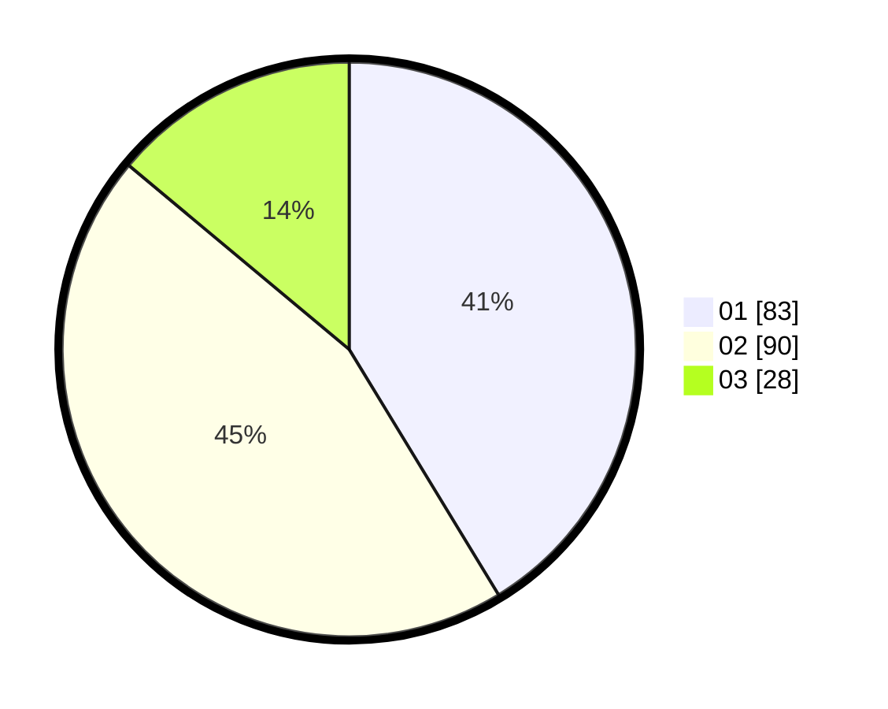

# Hasil

Hasil perolehan suara paslon dapat dilihat pada file paslon-01.txt, paslon-02.txt, dan paslon-03.txt.

Jika tidak ada, artinya data tersebut belum ada pada SIREKAP.

## Perolehan Suara

 * Paslon 01: **83**.
 * Paslon 02: **90**.
 * Paslon 03: **28**.

## Foto C Plano

https://sirekap-obj-formc.kpu.go.id/f415/pemilu/ppwp/31/71/02/10/05/3171021005031-20240214-195747--aa5d5f6d-e069-41b9-8f8d-d29a1511c590.jpg

https://sirekap-obj-formc.kpu.go.id/f415/pemilu/ppwp/31/71/02/10/05/3171021005031-20240214-195937--e30ceee7-d13a-4ef3-abda-8eeaf92e662f.jpg

https://sirekap-obj-formc.kpu.go.id/f415/pemilu/ppwp/31/71/02/10/05/3171021005031-20240214-200253--14ffb9b7-cc2f-4aea-890c-aa9b5c1e7b74.jpg
