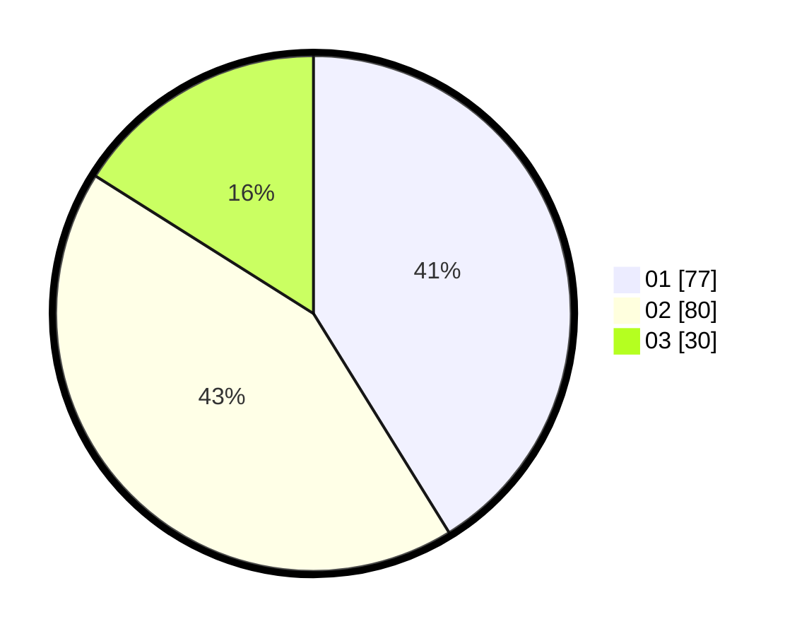

# Hasil

Hasil perolehan suara paslon dapat dilihat pada file paslon-01.txt, paslon-02.txt, dan paslon-03.txt.

Jika tidak ada, artinya data tersebut belum ada pada SIREKAP.

## Perolehan Suara

 * Paslon 01: **77**.
 * Paslon 02: **80**.
 * Paslon 03: **30**.

## Foto C Plano

https://sirekap-obj-formc.kpu.go.id/cb04/pemilu/ppwp/31/71/02/10/05/3171021005032-20240214-200053--d0ba124f-1875-4900-ba91-b93133a1f25c.jpg

https://sirekap-obj-formc.kpu.go.id/cb04/pemilu/ppwp/31/71/02/10/05/3171021005032-20240214-200204--2d3d6b21-c4d1-43c1-bd30-a691214df305.jpg

https://sirekap-obj-formc.kpu.go.id/cb04/pemilu/ppwp/31/71/02/10/05/3171021005032-20240214-200315--931dd3ca-429d-40b0-88b2-2352bcbcb32a.jpg

## DATA PEMILIH TETAP

Jumlah pemilih dalam DPT: **249**.
 * L: **130**.
 * P: **119**.

## DATA PENGGUNA HAK PILIH

Jumlah pengguna hak pilih dalam DPT: **191**.
 * L: **92**.
 * P: **99**.

Jumlah pengguna hak pilih dalam DPTb: **0**.
 * L: **0**.
 * P: **0**.

Jumlah pengguna hak pilih dalam DPK: **1**.
 * L: **1**.
 * P: **0**.

Jumlah pengguna hak pilih: **192**.
 * L: **93**.
 * P: **99**.

## JUMLAH SUARA SAH DAN TIDAK SAH

JUMLAH SELURUH SUARA SAH: **187**.

JUMLAH SUARA TIDAK SAH: **5**.

JUMLAH SELURUH SUARA SAH DAN SUARA TIDAK SAH: **192**.
