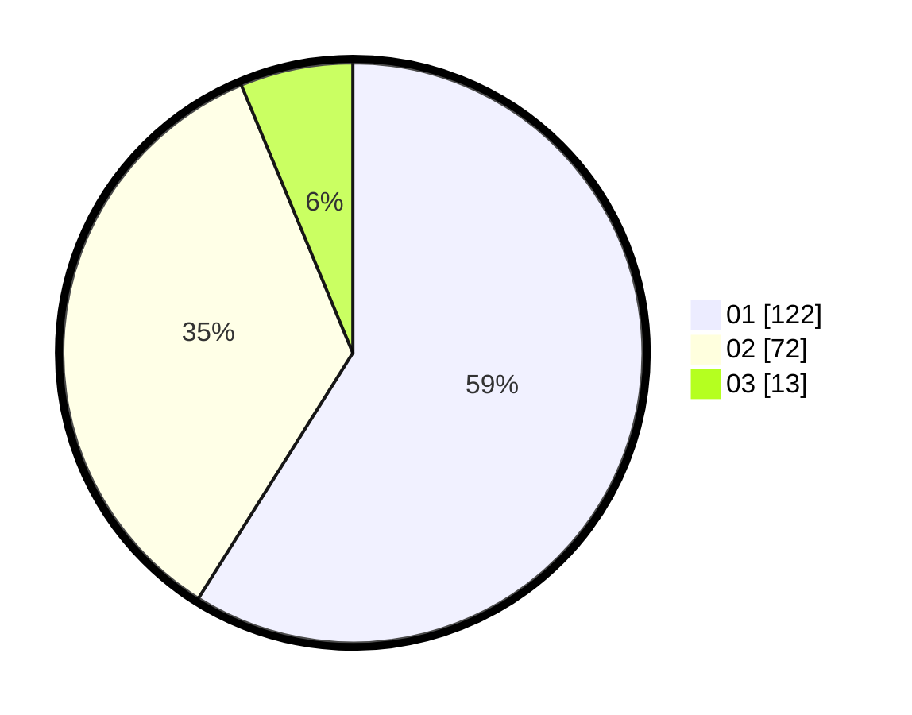

# Hasil

Hasil perolehan suara paslon dapat dilihat pada file paslon-01.txt, paslon-02.txt, dan paslon-03.txt.

Jika tidak ada, artinya data tersebut belum ada pada SIREKAP.

## Perolehan Suara

 * Paslon 01: **122**.
 * Paslon 02: **72**.
 * Paslon 03: **13**.

## Foto C Plano

https://sirekap-obj-formc.kpu.go.id/e276/pemilu/ppwp/31/71/02/10/05/3171021005035-20240215-022717--33d17bc1-d9d8-486a-b52a-67e5cd723baf.jpg

https://sirekap-obj-formc.kpu.go.id/e276/pemilu/ppwp/31/71/02/10/05/3171021005035-20240215-022744--8335f1c6-6136-4818-84c9-ec4b4fe8ff60.jpg
