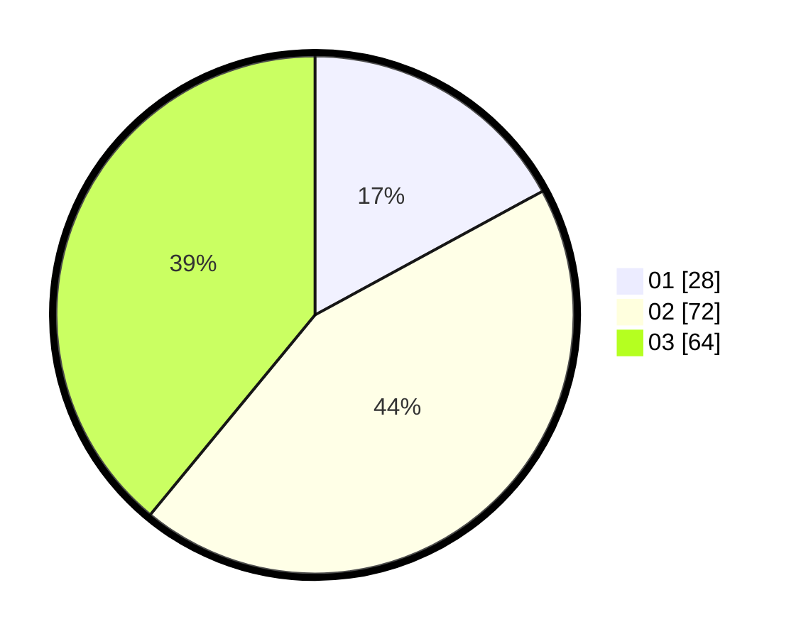

# Hasil

Hasil perolehan suara paslon dapat dilihat pada file paslon-01.txt, paslon-02.txt, dan paslon-03.txt.

Jika tidak ada, artinya data tersebut belum ada pada SIREKAP.

## Perolehan Suara

 * Paslon 01: **28**.
 * Paslon 02: **72**.
 * Paslon 03: **64**.

## Foto C Plano

https://sirekap-obj-formc.kpu.go.id/3e6c/pemilu/ppwp/31/71/02/10/05/3171021005049-20240214-230249--1d3af492-150d-45e8-9d10-1b8e6d3f88fc.jpg

https://sirekap-obj-formc.kpu.go.id/3e6c/pemilu/ppwp/31/71/02/10/05/3171021005049-20240214-230345--0a92a151-0598-4930-9d04-02d3437427cb.jpg
