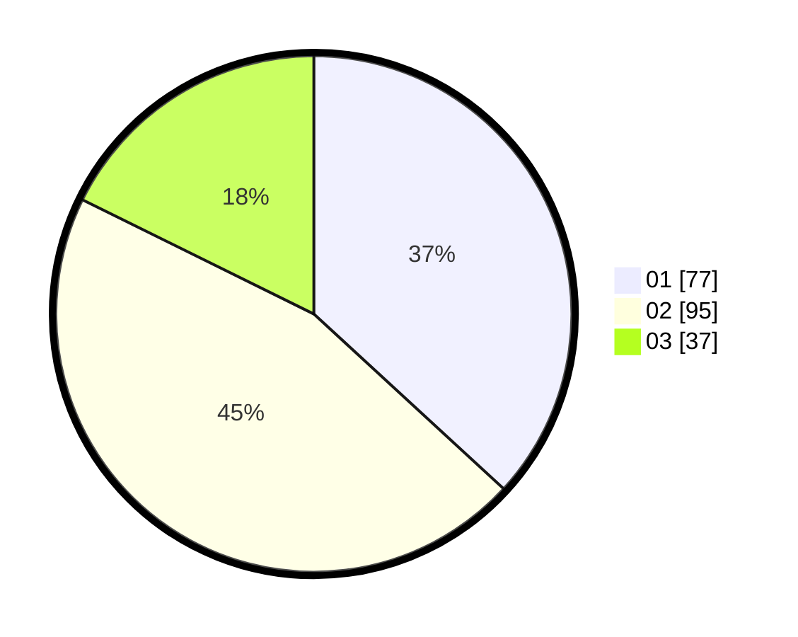

# Hasil

Hasil perolehan suara paslon dapat dilihat pada file paslon-01.txt, paslon-02.txt, dan paslon-03.txt.

Jika tidak ada, artinya data tersebut belum ada pada SIREKAP.

## Perolehan Suara

 * Paslon 01: **77**.
 * Paslon 02: **95**.
 * Paslon 03: **37**.

## Foto C Plano

https://sirekap-obj-formc.kpu.go.id/ef89/pemilu/ppwp/31/71/02/10/05/3171021005050-20240214-212330--20e666df-35d8-478e-9afd-80ee254c43d3.jpg

https://sirekap-obj-formc.kpu.go.id/ef89/pemilu/ppwp/31/71/02/10/05/3171021005050-20240214-194657--7d4d9ad0-14d8-42e0-a70a-5807c11081a9.jpg

https://sirekap-obj-formc.kpu.go.id/ef89/pemilu/ppwp/31/71/02/10/05/3171021005050-20240214-194628--91872977-3bd3-4c7b-8392-02b40f16f46c.jpg

## DATA PEMILIH TETAP

Jumlah pemilih dalam DPT: **255**.
 * L: **129**.
 * P: **126**.

## DATA PENGGUNA HAK PILIH

Jumlah pengguna hak pilih dalam DPT: **205**.
 * L: **105**.
 * P: **100**.

Jumlah pengguna hak pilih dalam DPTb: **7**.
 * L: **3**.
 * P: **4**.

Jumlah pengguna hak pilih dalam DPK: **3**.
 * L: **1**.
 * P: **2**.

Jumlah pengguna hak pilih: **215**.
 * L: **109**.
 * P: **106**.

## JUMLAH SUARA SAH DAN TIDAK SAH

JUMLAH SELURUH SUARA SAH: **209**.

JUMLAH SUARA TIDAK SAH: **6**.

JUMLAH SELURUH SUARA SAH DAN SUARA TIDAK SAH: **215**.
