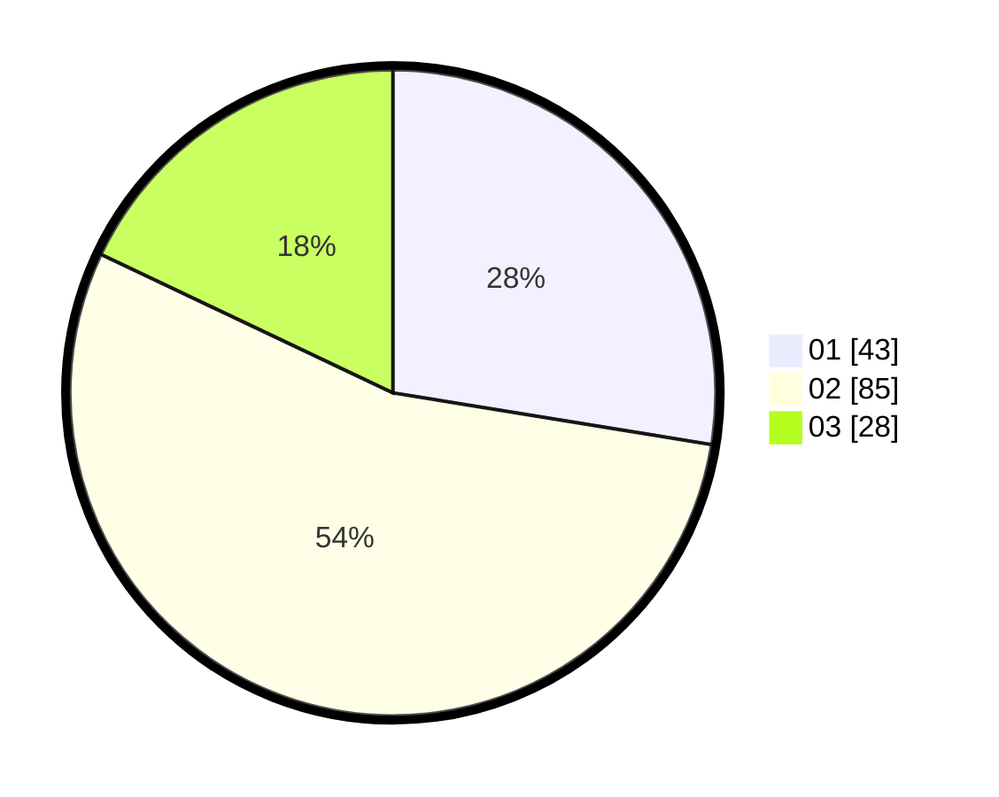

# Hasil

Hasil perolehan suara paslon dapat dilihat pada file paslon-01.txt, paslon-02.txt, dan paslon-03.txt.

Jika tidak ada, artinya data tersebut belum ada pada SIREKAP.

## Perolehan Suara

 * Paslon 01: **43**.
 * Paslon 02: **85**.
 * Paslon 03: **28**.

## Foto C Plano

https://sirekap-obj-formc.kpu.go.id/eedc/pemilu/ppwp/31/71/02/10/05/3171021005054-20240214-221515--cced8580-a7e8-4f32-8fc6-0565698b21dd.jpg

https://sirekap-obj-formc.kpu.go.id/eedc/pemilu/ppwp/31/71/02/10/05/3171021005054-20240214-221517--32b11683-2787-4eaa-a51b-e2b14eb91303.jpg

https://sirekap-obj-formc.kpu.go.id/eedc/pemilu/ppwp/31/71/02/10/05/3171021005054-20240214-221519--5993752b-8636-4392-8317-ee004cadafd1.jpg

## DATA PEMILIH TETAP

Jumlah pemilih dalam DPT: **267**.
 * L: **137**.
 * P: **130**.

## DATA PENGGUNA HAK PILIH

Jumlah pengguna hak pilih dalam DPT: **155**.
 * L: **74**.
 * P: **81**.

Jumlah pengguna hak pilih dalam DPTb: **0**.
 * L: **0**.
 * P: **0**.

Jumlah pengguna hak pilih dalam DPK: **2**.
 * L: **1**.
 * P: **1**.

Jumlah pengguna hak pilih: **157**.
 * L: **75**.
 * P: **82**.

## JUMLAH SUARA SAH DAN TIDAK SAH

JUMLAH SELURUH SUARA SAH: **156**.

JUMLAH SUARA TIDAK SAH: **1**.

JUMLAH SELURUH SUARA SAH DAN SUARA TIDAK SAH: **157**.
