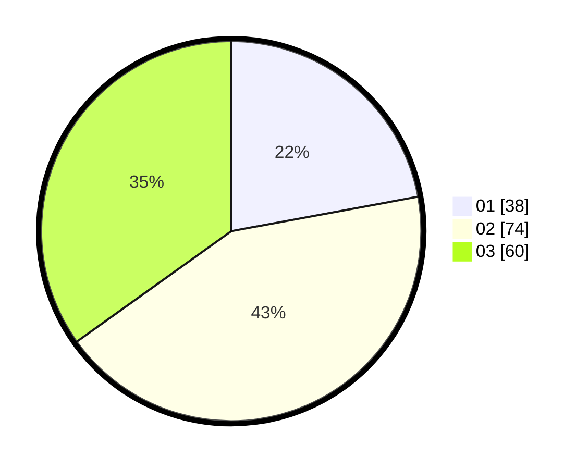

# Hasil

Hasil perolehan suara paslon dapat dilihat pada file paslon-01.txt, paslon-02.txt, dan paslon-03.txt.

Jika tidak ada, artinya data tersebut belum ada pada SIREKAP.

## Perolehan Suara

 * Paslon 01: **38**.
 * Paslon 02: **74**.
 * Paslon 03: **60**.

## Foto C Plano

https://sirekap-obj-formc.kpu.go.id/84c5/pemilu/ppwp/31/71/02/10/05/3171021005055-20240215-125109--a21ee1f2-12f3-4bd9-a36a-a6106b2809b0.jpg

https://sirekap-obj-formc.kpu.go.id/84c5/pemilu/ppwp/31/71/02/10/05/3171021005055-20240215-125210--a5ba26b3-5f12-4940-a7d5-cc6de9fc1852.jpg

https://sirekap-obj-formc.kpu.go.id/84c5/pemilu/ppwp/31/71/02/10/05/3171021005055-20240215-125345--4e6da236-66c5-4bcf-be3b-96c82c76b06a.jpg

## DATA PEMILIH TETAP

Jumlah pemilih dalam DPT: **273**.
 * L: **147**.
 * P: **126**.

## DATA PENGGUNA HAK PILIH

Jumlah pengguna hak pilih dalam DPT: **172**.
 * L: **87**.
 * P: **85**.

Jumlah pengguna hak pilih dalam DPTb: **1**.
 * L: **0**.
 * P: **1**.

Jumlah pengguna hak pilih dalam DPK: **3**.
 * L: **1**.
 * P: **2**.

Jumlah pengguna hak pilih: **176**.
 * L: **88**.
 * P: **88**.

## JUMLAH SUARA SAH DAN TIDAK SAH

JUMLAH SELURUH SUARA SAH: **172**.

JUMLAH SUARA TIDAK SAH: **4**.

JUMLAH SELURUH SUARA SAH DAN SUARA TIDAK SAH: **176**.
