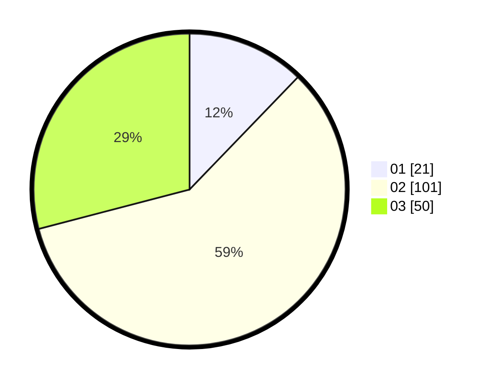

# Hasil

Hasil perolehan suara paslon dapat dilihat pada file paslon-01.txt, paslon-02.txt, dan paslon-03.txt.

Jika tidak ada, artinya data tersebut belum ada pada SIREKAP.

## Perolehan Suara

 * Paslon 01: **21**.
 * Paslon 02: **101**.
 * Paslon 03: **50**.

## Foto C Plano

https://sirekap-obj-formc.kpu.go.id/62fd/pemilu/ppwp/31/71/02/10/05/3171021005056-20240214-194438--f7c1a5db-9123-4af9-914b-228e45976ab1.jpg

https://sirekap-obj-formc.kpu.go.id/62fd/pemilu/ppwp/31/71/02/10/05/3171021005056-20240214-194550--0002cc37-36da-48d3-affc-80d04ba91e5d.jpg

https://sirekap-obj-formc.kpu.go.id/62fd/pemilu/ppwp/31/71/02/10/05/3171021005056-20240214-194630--ec888bec-1f94-4faf-bdab-cea7871d9ced.jpg

## DATA PEMILIH TETAP

Jumlah pemilih dalam DPT: **241**.
 * L: **125**.
 * P: **116**.

## DATA PENGGUNA HAK PILIH

Jumlah pengguna hak pilih dalam DPT: **161**.
 * L: **86**.
 * P: **75**.

Jumlah pengguna hak pilih dalam DPTb: **13**.
 * L: **8**.
 * P: **5**.

Jumlah pengguna hak pilih dalam DPK: **0**.
 * L: **0**.
 * P: **0**.

Jumlah pengguna hak pilih: **174**.
 * L: **94**.
 * P: **80**.

## JUMLAH SUARA SAH DAN TIDAK SAH

JUMLAH SELURUH SUARA SAH: **172**.

JUMLAH SUARA TIDAK SAH: **2**.

JUMLAH SELURUH SUARA SAH DAN SUARA TIDAK SAH: **174**.
