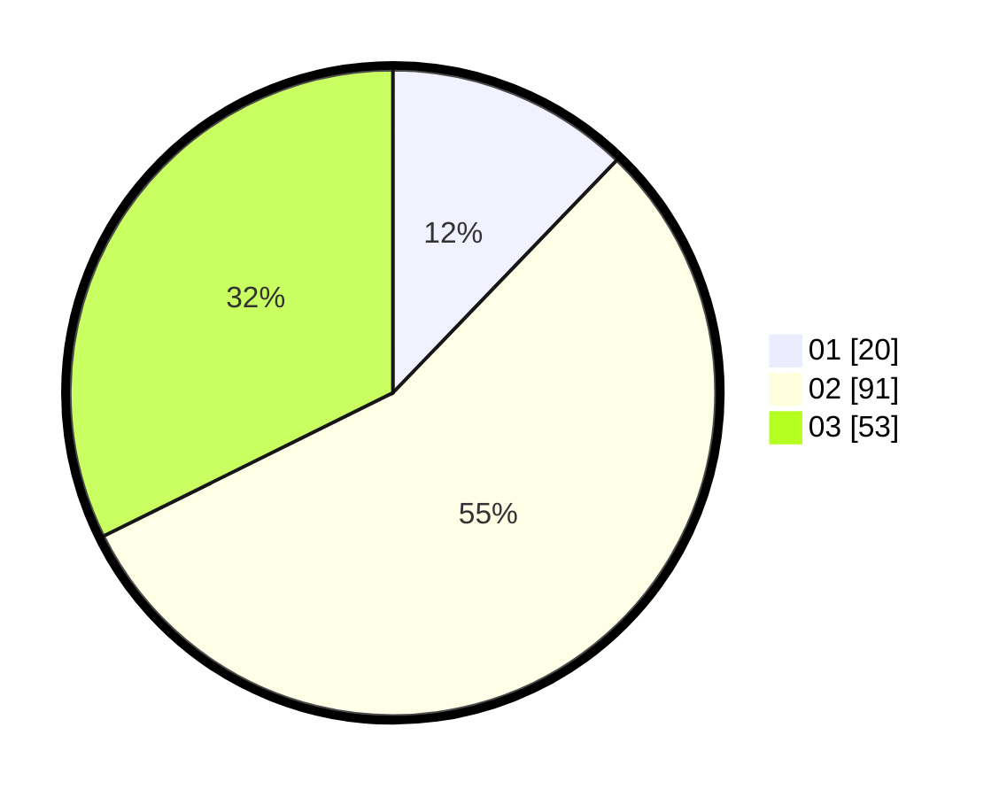

# Hasil

Hasil perolehan suara paslon dapat dilihat pada file paslon-01.txt, paslon-02.txt, dan paslon-03.txt.

Jika tidak ada, artinya data tersebut belum ada pada SIREKAP.

## Perolehan Suara

 * Paslon 01: **20**.
 * Paslon 02: **91**.
 * Paslon 03: **53**.

## Foto C Plano

https://sirekap-obj-formc.kpu.go.id/72c2/pemilu/ppwp/31/71/02/10/05/3171021005058-20240216-111524--9f8d996e-c716-4722-a21b-d5aa445bc55d.jpg

https://sirekap-obj-formc.kpu.go.id/72c2/pemilu/ppwp/31/71/02/10/05/3171021005058-20240216-111525--136f20bf-f619-43a6-97d2-5df11f6cfc3e.jpg

https://sirekap-obj-formc.kpu.go.id/72c2/pemilu/ppwp/31/71/02/10/05/3171021005058-20240216-111525--41b89819-a475-49e6-8be2-af85e68ebe24.jpg

## DATA PEMILIH TETAP

Jumlah pemilih dalam DPT: **267**.
 * L: **131**.
 * P: **136**.

## DATA PENGGUNA HAK PILIH

Jumlah pengguna hak pilih dalam DPT: **164**.
 * L: **79**.
 * P: **85**.

Jumlah pengguna hak pilih dalam DPTb: **0**.
 * L: **0**.
 * P: **0**.

Jumlah pengguna hak pilih dalam DPK: **1**.
 * L: **0**.
 * P: **1**.

Jumlah pengguna hak pilih: **165**.
 * L: **79**.
 * P: **86**.

## JUMLAH SUARA SAH DAN TIDAK SAH

JUMLAH SELURUH SUARA SAH: **164**.

JUMLAH SUARA TIDAK SAH: **1**.

JUMLAH SELURUH SUARA SAH DAN SUARA TIDAK SAH: **165**.
